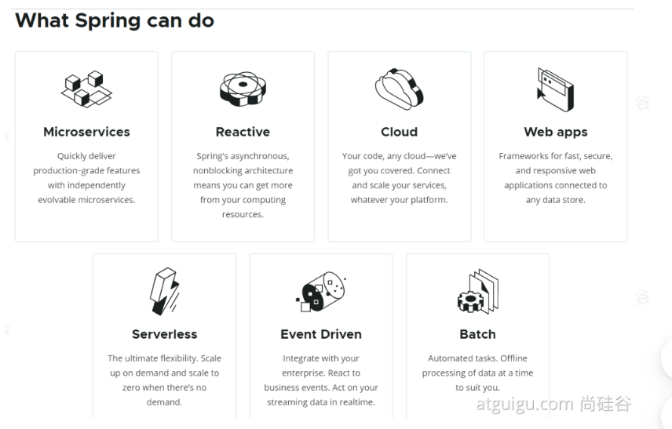
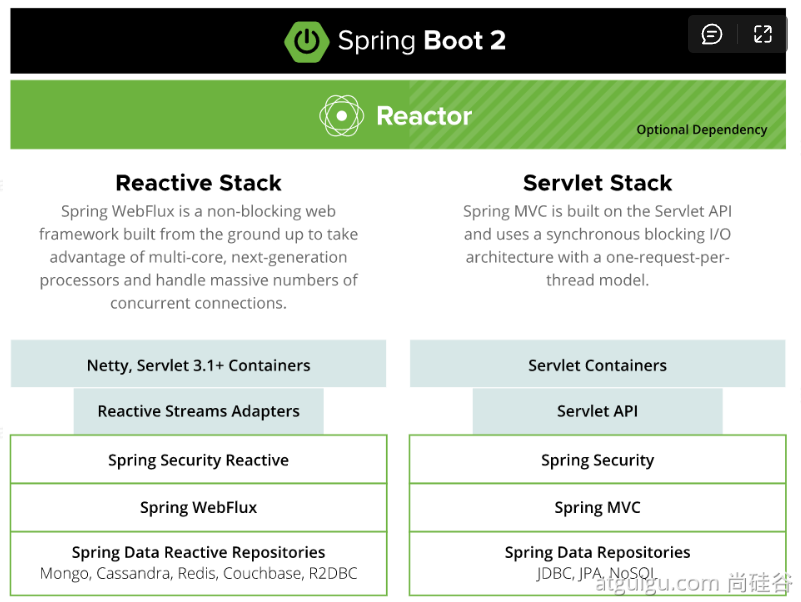
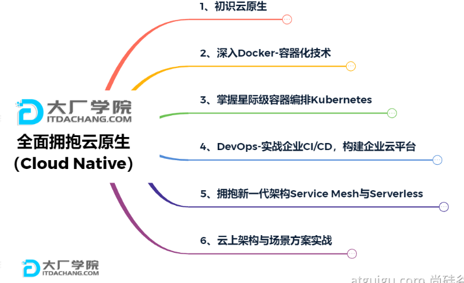
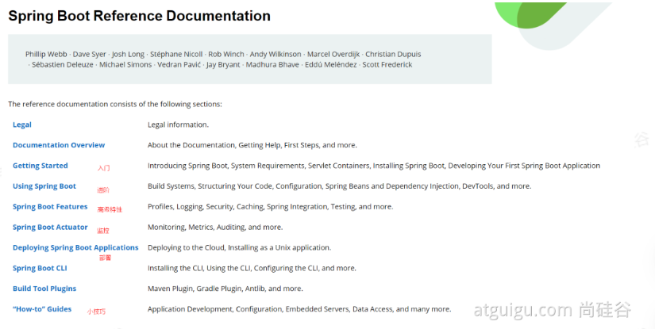
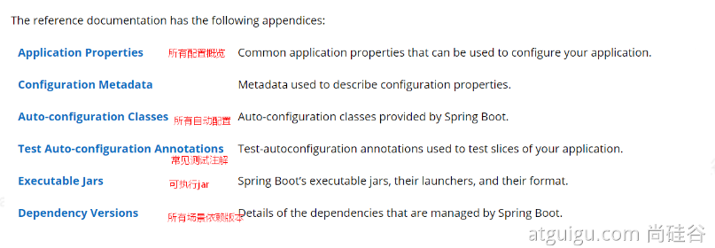

# SpringBoot2

[TOC]

# 第一季：SpringBoot2核心技术——基础入门

## 一、SpringBoot与SpringBoot

### 1、Spring能做什么

#### 1.1、Spring的能力

#### 1.2、Spring的生态

https://spring.io/projects/spring-boot

覆盖了：web开发、数据访问、安全控制、分布式、消息服务、移动开发、批处理····

#### 1.3、Spring5重大升级

- 响应式编程

- 内部源码设计
  - 基于java8的一些新特性，如：接口默认实现。重新设计源码架构


### 2、为什么用SpringBoot

> Spring Boot makes it easy to create stand-alone, production-grade Spring based Applications that you can "just run".
>
> 能快速创建生产级别的Spring应用

#### 2.1、SpringBoot优点

> SpringBoot是整合Spring技术栈的一站式框架
>
> SpringBoot是简化Spring技术栈的快速开发脚手架

- 创建独立Spring应用
- 内嵌web服务器
- 自动stater依赖，简化构建配置
- 自动配置Spring以及第三方功能
- 提供生产级别的监控、健康检查以及外部化配置
- 无代码生成、无需编写XML

#### 2.2、SpringBoot的缺点

- 迭代快，需要时刻关注变化
- 封装太深，内部原理复杂，不容易精通


### 3、时代背景

#### 3.1、微服务

[James Lewis and Martin Fowler (2014)](https://martinfowler.com/articles/microservices.html)  提出微服务完整概念。

文档：https://martinfowler.com/microservices/

- 微服务是一种架构风格
- 一个应用拆分为一组小型服务
- 每个服务运行再自己的进程内，也就是可独立部署和升级
- 服务之间使用轻量级HTTP交互
- 服务围绕业务功能拆分
- 可以由全自动部署机制独立部署
- 去中心化，服务全治。服务可以使用不同的语言、不同存储技术

#### 3.2、分布式

- 分布式的困难

  - 远程调用、服务发现、负载均衡

  - 服务容错、配置管理、服务监控

  - 链路追踪、日志管理、任务调度······

- 分布式的解决
  - **SpringBoot+SpringCloud**

#### 3.3、云原生

**上云的困难**

- 服务自愈、弹性伸缩、服务隔离
- 自动化部署、灰度发布、流量治理

**上云的解决**


### 4、如何学习SpringBoot

#### 4.1、官网文档架构



查看版本新特性

https://github.com/spring-projects/spring-boot/wiki#release-notes


## 二、SpringBoot2入门

### 1、系统要求

- java8  & 兼容java 14  +
- Maven 3.3+
- IDEA 2019.1.2 +

#### 1.1、Maven设置

```xml
<!--设置镜像-->
<mirrors>
      <mirror>
        <id>nexus-aliyun</id>
        <mirrorOf>central</mirrorOf>
        <name>Nexus aliyun</name>
        <url>http://maven.aliyun.com/nexus/content/groups/public</url>
      </mirror>
  </mirrors>

<!--配置java版本-->
  <profiles>
         <profile>
              <id>jdk-1.8</id>
              <activation>
                <activeByDefault>true</activeByDefault>
                <jdk>1.8</jdk>
              </activation>
              <properties>
                <maven.compiler.source>1.8</maven.compiler.source>
                <maven.compiler.target>1.8</maven.compiler.target>
                <maven.compiler.compilerVersion>1.8</maven.compiler.compilerVersion>
              </properties>
         </profile>
  </profiles>
```


### 2、HelloWorld

需求：浏览器发送 /hello 请求，响应HelloWorld，SpringBoot2

#### 2.1、创建Maven工程

#### 2.2、引入依赖

#### 2.3、创建主程序

#### 2.4、编写业务

#### 2.5、测试

#### 2.6、简化配置

#### 2.7、简化部署


## 三、了解自动配置原理


# 第一季：SpringBoot2核心技术——核心功能

## 四、配置文件

## 五、Web开发

## 六、数据访问

## 七、单元测试

## 八、指标监控

## 九、原理解析


# 附录

文档地址： https://www.yuque.com/atguigu/springboot

视频地址：https://www.bilibili.com/video/BV19K4y1L7MT?p=1

源码地址：https://gitee.com/leifengyang/springboot2

