# SpringBoot2

[TOC]

# 第一季：SpringBoot2核心技术——基础入门

## 一、SpringBoot与SpringBoot

### 1、Spring能做什么

#### 1.1、Spring的能力

#### 1.2、Spring的生态

https://spring.io/projects/spring-boot

覆盖了：web开发、数据访问、安全控制、分布式、消息服务、移动开发、批处理····

#### 1.3、Spring5重大升级

- 响应式编程

- 内部源码设计
  - 基于java8的一些新特性，如：接口默认实现。重新设计源码架构


### 2、为什么用SpringBoot

> Spring Boot makes it easy to create stand-alone, production-grade Spring based Applications that you can "just run".
>
> 能快速创建生产级别的Spring应用

#### 2.1、SpringBoot优点

> SpringBoot是整合Spring技术栈的一站式框架
>
> SpringBoot是简化Spring技术栈的快速开发脚手架

- 创建独立Spring应用
- 内嵌web服务器
- 自动stater依赖，简化构建配置
- 自动配置Spring以及第三方功能
- 提供生产级别的监控、健康检查以及外部化配置
- 无代码生成、无需编写XML

#### 2.2、SpringBoot的缺点

- 迭代快，需要时刻关注变化
- 封装太深，内部原理复杂，不容易精通


### 3、时代背景

#### 3.1、微服务

[James Lewis and Martin Fowler (2014)](https://martinfowler.com/articles/microservices.html)  提出微服务完整概念。

文档：https://martinfowler.com/microservices/

- 微服务是一种架构风格
- 一个应用拆分为一组小型服务
- 每个服务运行再自己的进程内，也就是可独立部署和升级
- 服务之间使用轻量级HTTP交互
- 服务围绕业务功能拆分
- 可以由全自动部署机制独立部署
- 去中心化，服务全治。服务可以使用不同的语言、不同存储技术

#### 3.2、分布式

- 分布式的困难

  - 远程调用、服务发现、负载均衡

  - 服务容错、配置管理、服务监控

  - 链路追踪、日志管理、任务调度······

- 分布式的解决
  - **SpringBoot+SpringCloud**

#### 3.3、云原生

**上云的困难**

- 服务自愈、弹性伸缩、服务隔离
- 自动化部署、灰度发布、流量治理

**上云的解决**


### 4、如何学习SpringBoot

#### 4.1、官网文档架构


查看版本新特性

https://github.com/spring-projects/spring-boot/wiki#release-notes


## 二、SpringBoot2入门

### 1、系统要求

- java8  & 兼容java 14  +
- Maven 3.3+
- IDEA 2019.1.2 +

#### 1.1、Maven设置

```xml
<!--设置镜像-->
<mirrors>
      <mirror>
        <id>nexus-aliyun</id>
        <mirrorOf>central</mirrorOf>
        <name>Nexus aliyun</name>
        <url>http://maven.aliyun.com/nexus/content/groups/public</url>
      </mirror>
  </mirrors>

<!--配置java版本-->
  <profiles>
         <profile>
              <id>jdk-1.8</id>
              <activation>
                <activeByDefault>true</activeByDefault>
                <jdk>1.8</jdk>
              </activation>
              <properties>
                <maven.compiler.source>1.8</maven.compiler.source>
                <maven.compiler.target>1.8</maven.compiler.target>
                <maven.compiler.compilerVersion>1.8</maven.compiler.compilerVersion>
              </properties>
         </profile>
  </profiles>
```

## 

### 2、HelloWorld

需求：浏览器发送 /hello 请求，响应HelloWorld，SpringBoot2

#### 2.1、创建Maven工程

#### 2.2、引入依赖

```xml
<parent>
    <groupId>org.springframework.boot</groupId>
    <artifactId>spring-boot-starter-parent</artifactId>
    <version>2.3.4.RELEASE</version>
</parent>
<dependencies>
    <dependency>
        <groupId>org.springframework.boot</groupId>
        <artifactId>spring-boot-starter-web</artifactId>
    </dependency>
</dependencies>
```

#### 2.3、创建主程序

```java
/**
 * 主程序类
 * @SpringBootApplication：这是一个SpringBoot应用
 */
@SpringBootApplication
public class MainApplication {

    public static void main(String[] args) {
        SpringApplication.run(MainApplication.class,args);
    }
}
```

#### 2.4、编写业务

```java
//等同于 @Controller 和 @ResponseBody 合体
@RestController
public class HelloController {
    @RequestMapping("/hello")
    public String handle01(){
        return "Hello, Spring Boot 2!";
    }
}
```

#### 2.5、测试

直接运行main方法

#### 2.6、简化配置

**application.properties**

```properties
server.port=8888
```

#### 2.7、简化部署

```xml
 <build>
    <plugins>
        <plugin>
            <groupId>org.springframework.boot</groupId>
            <artifactId>spring-boot-maven-plugin</artifactId>
        </plugin>
    </plugins>
</build>
```

把项目打包为jar包，直接在目标服务器执行即可

**在jar包所在目录下运行**

```sh
java -jar jar包名
```

注意：

- 取消掉cmd的快速编辑模式


## 三、了解自动配置原理

### 1、SpringBoot特点

#### 1.1、依赖管理

- 父项目做依赖管理

  ```xml
  <!--依赖管理-->
  <parent>
      <groupId>org.springframework.boot</groupId>
      <artifactId>spring-boot-starter-parent</artifactId>
      <version>2.3.4.RELEASE</version>
  </parent>
  
  <!--它的父项目-->
  <parent>
      <groupId>org.springframework.boot</groupId>
      <artifactId>spring-boot-dependencies</artifactId>
      <version>2.3.4.RELEASE</version>
  </parent>
  
  <!--父项目主要功能：几乎声明了所有开发中常用的依赖的版本号，自动版本仲裁机制-->
  <!--也就是指定了父项目版本号之后，相关依赖的版本自动设置-->
  ```

- 开发导入starter场景启动器

  ```xml
  <!--
  1、见到很多 spring-boot-starter-* ： *就某种场景
  2、只要引入starter，这个场景的所有常规需要的依赖我们都自动引入
  3、SpringBoot所有支持的场景
  	https://docs.spring.io/spring-boot/docs/current/reference/html/using-spring-boot.html#using-boot-starter
  4、见到的  *-spring-boot-starter： 第三方为我们提供的简化开发的场景启动器。也就是自己创建的场景
  5、所有场景启动器最底层的依赖
  -->
  <dependency>
  	<groupId>org.springframework.boot</groupId>
      <artifactId>spring-boot-starter</artifactId>
      <version>2.3.4.RELEASE</version>
      <scope>compile</scope>
  </dependency>
  ```

- 无需关注版本号，自动版本仲裁

  ```xml
  1、引入依赖默认都可以不写版本
  2、引入非版本仲裁的jar，要写版本号。
  ```

- 可以修改默认版本号

  ```xml
  <!--
  1、查看spring-boot-dependencies里面规定当前依赖的版本用的 key。
  2、在当前项目里面重写配置，重新修改默认的版本号
  -->
  <properties>
      <mysql.version>5.1.43</mysql.version>
  </properties>
  ```

#### 1.2、自动配置

- 自动配置好Tomcat

  - 引入Tomcat依赖——引入web场景时自动引入
  - 配置Tomcat

  ```xml
  <dependency>
      <groupId>org.springframework.boot</groupId>
      <artifactId>spring-boot-starter-tomcat</artifactId>
      <version>2.3.4.RELEASE</version>
      <scope>compile</scope>
  </dependency>
  ```

- 自动配置好SpringMVC

  - 引入SpringMVC全套组件
  - 自动配好SpringMVC常用功能

- 自动配好Web常见功能：比如编码问题

  - SpringBoot帮我们配好了所有web开发的常见场景

- 默认的包结构

  - **主程序所在包及其下面的子包**里面的组件都会默认扫描进来【也就是注解生效】
  - 无需以前的包扫描配置
  - 想要改变扫描路径
    - 在主程序类**@SpringBootApplication(scanBasePackages="com.atguigu")**
    - 或者**@ComponetScan 指定扫描路径**

  ```java
  @SpringBootApplication
  //等同于
  @SpringBootConfiguration
  @EnableAutoConfiguration
  @ComponentScan("com.atguigu.boot")    //指定扫描文件，向下包含扫描（也就是包含子孙包）
  ```

- 各种配置拥有默认值

  - 默认配置最终都是映射到某个类上
  - 配置文件的值最终会绑定每个类上，这个类会在容器中创建对象

- 按需加载所有自动配置项

  - 非常多的starter
  - 引入了哪些场景这个场景的自动配置才会开启
  - SpringBoot所有的自动配置功能都在spring-boot-autoconfigure包里面


### 2、容器功能

#### 2.1、组件添加

##### 1、@Configuration

- 基本使用
- **Full模式和Lite模式**
  - 配置 类组件之间**无依赖关系**用Lite模式加速容器启动过程，减少判断
  - 配置 类组件之间**有依赖关系**，方法会被调用得到之间单实例组件，用Full模式

```java
/*@Configuration使用示例*/

/**
 * 1、配置类里面使用@Bean标注在方法上给容器注册组件，默认也是单实例的
 * 2、配置类本身也是组件
 * 3、proxyBeanMethods：代理bean的方法，默认为true
 *      Full(proxyBeanMethods = true)、【保证每个@Bean方法被调用多少次返回的组件都是单实例的】
 *      Lite(proxyBeanMethods = false)【每个@Bean方法被调用多少次返回的组件都是新创建的，不会保存代理】
 *      组件依赖必须使用Full模式默认。其他默认是否Lite模式
 */

@Configuration(proxyBeanMethods = false) //告诉SpringBoot这是一个配置类  == 配置文件
public class MyConfig{
    
    /**
    * Full:外部无论对配置类中的这个组件注册方法调用多少次获得的都是之前注册容器中的单实例对象
    * @return
    */
    
    //bean没有给value值默认值为方法名，也就是组件id
    @Bean //给容器添加组件。以方法名作为组件的id。返回类型就是组件类型。返回的值，就是组件在容器中的实例
    public User user01(){
        User zhansan = new User("zhangsan",18);
        //user组件依赖了Pet组件
        zhangsan.setPet(tomcatPet());
        return zhangsan;
    }
    
    @Bean("tom")
    public Pet tomcatPet(){
        return new Pet("tomcat");
    }
}
```

```java 
/*@Configuration测试代码*/

@SpringBootConfiguration
@EnableAutoConfiguration
@ComponeScan("com.atguigu.boot")
public class MainApplication{
    public static void main(String[] args){
        //1、返回IOC容器
        ConfigurableApplicationContext run = SpringApplication(MainApplication.class,args);
        
        //2、查看容器里面的组件
        String[] names = run.getBeanDefinitionNames();
        for(String name : names){
            System.out.println(name);
        }
        
        //3、从容器中获取组件
        Pet tom01 = run.getBean("tom",Pet.class);
        Pet tom02 = run.getBean("tom",Pet.class);
        System.out.println("组件："+(tom01 == tom02));
        
        //4、com.atguigu.boot.config.MyConfig$$EnhancerBySpringCGLIB$$51f1e1ca@1654a892
        MyConfig bean = run.getBean(MyConfig.class);
        System.out.println(bean);
        
        //如果@Configuration(proxyBeanMethods = true)代理对象调用方法。SpringBoot总会检查这个组件是否在容器中有。
        //也就是保持组件单实例
        //如果proxyBeanMethods为false，那么组件为多实例，每次调用组件地址都不相同
        User user = bean.user01();
        User user1 = bean.user01();
        System.out.println(user == user1);
        
        User user01 = run.getBean("user01", User.class);
        Pet tom = run.getBean("tom", Pet.class);

        System.out.println("用户的宠物："+(user01.getPet() == tom));
    }
}
```

##### 2、@Bean、@Component、@Controller、@Service、@Repository

##### 3、@ComponentScan、@Import

```java
/** 
 * 4、@Import({User.class, DBHelper.class})
 *      给容器中自动创建出这两个类型的组件、默认组件的名字就是全类名
 */

@Import({User.class, DBHelper.class})
@Configuration(proxyBeanMethods = false) //告诉SpringBoot这是一个配置类 == 配置文件
public class MyConfig {
}
```

##### 4、@Conditional

条件装配：满足@Conditional指定的条件，则进行组件注入

```java
=====================测试条件装配==========================
@Configuration(proxyBeanMethods = false) //告诉SpringBoot这是一个配置类 == 配置文件
//@ConditionalOnBean(name = "tom")
@ConditionalOnMissingBean(name = "tom")
public class MyConfig {


    /**
     * Full:外部无论对配置类中的这个组件注册方法调用多少次获取的都是之前注册容器中的单实例对象
     * @return
     */

    @Bean //给容器中添加组件。以方法名作为组件的id。返回类型就是组件类型。返回的值，就是组件在容器中的实例
    public User user01(){
        User zhangsan = new User("zhangsan", 18);
        //user组件依赖了Pet组件
        zhangsan.setPet(tomcatPet());
        return zhangsan;
    }

    @Bean("tom22")
    public Pet tomcatPet(){
        return new Pet("tomcat");
    }
}

public static void main(String[] args) {
        //1、返回我们IOC容器
        ConfigurableApplicationContext run = SpringApplication.run(MainApplication.class, args);

        //2、查看容器里面的组件
        String[] names = run.getBeanDefinitionNames();
        for (String name : names) {
            System.out.println(name);
        }

        boolean tom = run.containsBean("tom");
        System.out.println("容器中Tom组件："+tom);

        boolean user01 = run.containsBean("user01");
        System.out.println("容器中user01组件："+user01);

        boolean tom22 = run.containsBean("tom22");
        System.out.println("容器中tom22组件："+tom22);


    }
```


#### 2.2、原生配置文件引入

##### 1、@ImportResource

```xml
======================beans.xml=========================
<?xml version="1.0" encoding="UTF-8"?>
<beans xmlns="http://www.springframework.org/schema/beans"
       xmlns:xsi="http://www.w3.org/2001/XMLSchema-instance"
       xmlns:context="http://www.springframework.org/schema/context"
       xsi:schemaLocation="http://www.springframework.org/schema/beans
                           http://www.springframework.org/schema/beans/spring-beans.xsd
                           http://www.springframework.org/schema/context
                           https://www.springframework.org/schema/context/spring-context.xsd">

    <bean id="haha" class="com.atguigu.boot.bean.User">
        <property name="name" value="zhangsan"></property>
        <property name="age" value="18"></property>
    </bean>

    <bean id="hehe" class="com.atguigu.boot.bean.Pet">
        <property name="name" value="tomcat"></property>
    </bean>
</beans>
```

```java
@ImportResource("classpath:beans.xml")
public class MyConfig{}

//测试
	boolean haha = run.containsBean("haha");
    boolean hehe = run.containsBean("hehe");
    System.out.println("haha："+haha);//true
    System.out.println("hehe："+hehe);//true
```


#### 2.3、配置绑定

如何使用java读取到properties文件中的内容，并且把它封装到JavaBean中，以供随时使用

```java
public class getProperties {
     public static void main(String[] args) throws FileNotFoundException, IOException {
         Properties pps = new Properties();
         pps.load(new FileInputStream("a.properties"));
         Enumeration enum1 = pps.propertyNames();//得到配置文件的名字
         while(enum1.hasMoreElements()) {
             String strKey = (String) enum1.nextElement();
             String strValue = pps.getProperty(strKey);
             System.out.println(strKey + "=" + strValue);
             //封装到JavaBean。
         }
     }
 }
```

##### 1、@ConfigurationProperties

```java 
/**
 * 只有在容器中的组件，才会拥有SpringBoot提供的强大功能
 * ConfigurationProperties指定在配置文件中的前缀
 */
@Component
@ConfigurationProperties(prefix = "mycar")
public class Car {

    private String brand;
    private Integer price;

    public String getBrand() {
        return brand;
    }

    public void setBrand(String brand) {
        this.brand = brand;
    }

    public Integer getPrice() {
        return price;
    }

    public void setPrice(Integer price) {
        this.price = price;
    }

    @Override
    public String toString() {
        return "Car{" +
                "brand='" + brand + '\'' +
                ", price=" + price +
                '}';
    }
}
```

##### 2、@EnableConfigurationProperties  +  @ConfigurationProperties

##### 3、@Component  +  @ConfigurationProperties

```java 
@EnableConfigurationProperties(Car.class)
//1、开启Car配置绑定功能
//2、把这个Car这个组件自动注册到容器中
public class MyConfig {
}
```


### 3、自动配置原理入门

#### 3.1、引导加载自动配置类

```java 
@SpringBootConfiguration
@EnableAutoConfiguration
@ComponentScan(excludeFilters = { @Filter(type = FilterType.CUSTOM, classes =
                                          TypeExcludeFilter.class),
                                 @Filter(type = FilterType.CUSTOM, classes =
                                         AutoConfigurationExcludeFilter.class) })
public @interface SpringBootApplication{}

======================    
```

##### 1、@SpringBootConfiguration

@Configuration代表当前是一个配置类

##### 2、@ComponentScan

指定扫描哪些，Spring注解

##### 3、@EnableAutoConfiguration

```java
@AutoConfigurationPackage
@Import(AutoConfigurationImportSelector.class)
public @interface EnableAutoConfiguration {}
```

- @AutoConfigurationPackage

  - 自动配置包？指定了默认的包规则

    ```java
    @Import(AutoConfigurationPackages.Registrar.class)  //给容器中导入一个组件
    public @interface AutoConfigurationPackage {}
    
    //利用Registrar给容器中导入一系列组件
    //将指定的一个包下的所有组件导入进来？MainApplication 所在包下。
    
    ```

- @Import(AutoConfigurationImportSelector.class)

  - ```java
    1、利用getAutoConfigurationEntry(annotationMetadata);给容器中批量导入一些组件
    2、调用List<String> configurations = getCandidateConfigurations(annotationMetadata, attributes)获取到所有需要导入到容器中的配置类
    3、利用工厂加载 Map<String, List<String>> loadSpringFactories(@Nullable ClassLoader classLoader)；得到所有的组件
    4、从META-INF/spring.factories位置来加载一个文件。
    	默认扫描我们当前系统里面所有META-INF/spring.factories位置的文件
        spring-boot-autoconfigure-2.3.4.RELEASE.jar包里面也有META-INF/spring.factories
    ```

    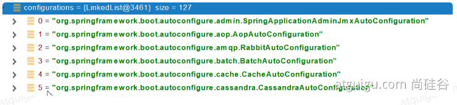


#### 3.2、按需开启自动配置项

```java
虽然我们127个场景的所有自动配置启动的时候默认全部加载。xxxxAutoConfiguration
按照条件装配规则**（@Conditional）**，最终会按需配置。
```


#### 3.3、修改默认配置

```java
        @Bean
		@ConditionalOnBean(MultipartResolver.class)  //容器中有这个类型组件
		@ConditionalOnMissingBean(name = DispatcherServlet.MULTIPART_RESOLVER_BEAN_NAME) //容器中没有这个名字 multipartResolver 的组件
		public MultipartResolver multipartResolver(MultipartResolver resolver) {
            //给@Bean标注的方法传入了对象参数，这个参数的值就会从容器中找。
            //SpringMVC multipartResolver。防止有些用户配置的文件上传解析器不符合规范
			// Detect if the user has created a MultipartResolver but named it incorrectly
			return resolver;
		}

//给容器中加入了文件上传解析器；
```

SpringBoot默认会在底层配好所有的组件。但是如果用户自己配置了**以用户的优先**

```java
@Bean
@ConditionalOnMissingBean
public CharacterEncodingFilter characterEncodingFilter() {}
```

==总结==

- SpringBoot先加载所有的自动配置类 XXXAutoConfiguration
- 每个自动配置类按照条件进行生效，默认都会绑定配置文件指定的值。XXXXProperties里面拿。XXXXProperties和配置文件进行绑定
- 生效的配置类就会给容器中装配很多组件
- 只要容器中有这些组件，相当于这些功能就有了
- 定制化配置
  - 用户直接自己@Bean替换底层的组件
  - 用户去看这个组件是获取的配置文件什么值就去修改

**xxxxAutoConfiguration --> 组件 --> xxxxProperties里面拿 --> application.properties**


#### 3.4、最佳实践（开发步骤）

- 引入场景依赖
  - https://docs.spring.io/spring-boot/docs/current/reference/html/using-spring-boot.html#using-boot-starter

- 查看自动配置了哪些（选做）——底层原理
  - 自己分析，引入场景对应的自动配置一般都生效了
  - 配置文件中**debug=true开启自动配置报告**。Negative（不生效）\Positive（生效）

- 是否需要修改
  - 参照文档修改配置项
  - ​	https://docs.spring.io/spring-boot/docs/current/reference/html/appendix-application-properties.html#common-application-properties
  - 自己分析。xxxxProperties绑定了配置文件的哪些。

- 自定义加入或者替换组件
  - @Bean、@Component······
  - 自定义器  **XXXXXCustomizer**；

- ......


### 4、开发小技巧

#### 4.1、Lombok与日志记录器

简化JavaBean开发

```java
@NoArgsConstructor	//无参构造器
@AllArgsConstructor	//所有参数的构造器
@ToString	//重写toString()
@Data	//生成已有属性的  getter 和  setter  方法
@EqualsAndHashCode	//重写HashCode和Equals
```

```xml
<dependency>
    <groupId>org.projectlombok</groupId>
    <artifactId>lombok</artifactId>
</dependency>

<!--idea中搜索安装lombok插件-->
```

```java 
/*===============================简化JavaBean开发===================================*/
@NoArgsConstructor   //无参构造器
//@AllArgsConstructor	//所有参数的构造器
@Data
@ToString  //重写ToString()
@EqualsAndHashCode
public class User {

    private String name;
    private Integer age;

    private Pet pet;

    public User(String name,Integer age){
        this.name = name;
        this.age = age;
    }
}

/*================================简化日志开发===================================*/
@Slf4j	//日志记录
@RestController
public class HelloController {
    @RequestMapping("/hello")
    public String handle01(@RequestParam("name") String name){
        
        log.info("请求进来了....");
        
        return "Hello, Spring Boot 2!"+"你好："+name;
    }
}
```


#### 4.2、dev-tools

热部署

```xml
<dependency>
    <groupId>org.springframework.boot</groupId>
    <artifactId>spring-boot-devtools</artifactId>
    <optional>true</optional>
</dependency>
```

项目或者页面修改以后：Ctrl+F9，重新编译部署


#### 4.3、Spring Initailizr（项目初始化向导）

**如果连接失败使用  http://start.springboot.io**


##### 1、选择我们需要的开发场景

##### 2、自动依赖导入

```xml
<parent>
    <groupId>org.springframework.boot</groupId>
    <artifactId>spring-boot-starter-parent</artifactId>
    <version>2.3.4.RELEASE</version>
    <relativePath/>
</parent>
<groupId>com.atguigu.boot</groupId>
<artifactId>boot-01-helloworld-2</artifactId>
<version>0.0.1-SNAPSHOT</version>
<name>boot-01-helloworld-2</name>
<description>Demo project for Spring Boot</description>

<properties>
    <java.version>1.8</java.version>
</properties>

<dependencies>
    <dependency>
        <groupId>org.springframework.boot</groupId>
        <artifactId>spring-boot-starter-data-redis</artifactId>
    </dependency>
    <dependency>
        <groupId>org.springframework.boot</groupId>
        <artifactId>spring-boot-starter-web</artifactId>
    </dependency>
</dependencies>
```

##### 3、自动创建项目结构

##### 4、自动编写好主配置类

```java 
@SpringBootApplication
public class Boot01Helloworld2Application{
    public static void main(String[] args){
        SpringApplication.run(Boot01Helloworld2Application.class,agrs);
    }
}
```


# 第一季：SpringBoot2核心技术——核心功能

## 四、配置文件

### 1、文件类型

#### 1.1、properties

同以前的properties写法

#### 1.2、yaml

##### 1.2.1、简介

YAML 是 "YAML Ain't Markup Language"（YAML 不是一种标记语言）的递归缩写。在开发的这种语言时，YAML 的意思其实是："Yet Another Markup Language"（仍是一种标记语言）。 

非常适合用来做**以数据为中心**的配置文件

##### 1.2.2、基本语法

- key: value ；  **kv之间有空格**
- 大小写敏感
- 使用缩进表示层级关系
- 缩进不允许使用Tab，只允许空格
- 缩进的空格数不重要，只要相同级别的元素**左对齐**即可
- ‘#’ 表示注释
- 字符串无需加引号，如果要加，“与”表示字符串内容会被 转义/不转义
  - **单引号会将 \n 作为字符串输出**
  - **双引号不会将 \n 作为换行输出**


##### 1.2.3、数据类型

- 字面量：单个的、不可再分的值。data、boolean、string、number、null

  ```yaml
  k: v
  ```

- 对象：键值对的集合。map、hash、set、object

  ```yaml
  # 行内写法  
  k: {k1: v1,k2: v2,k3: v3}
  # 或
  k:
  	k1: v1
  	k2: v2
  	k3: v3
  ```

- 数组：一组按次序排列的值。array、list、queue

  ```yaml
  # 行内写法
  k: [v1,v2,v3]
  # 或
  k: 
  	- v1
  	- v2
  	- v3
  ```

##### 1.2.4、示例

```java 
@Data
public class Person {
	
	private String userName;
	private Boolean boss;
	private Date birth;
	private Integer age;
	private Pet pet;
	private String[] interests;
	private List<String> animal;
	private Map<String, Object> score;
	private Set<Double> salarys;
	private Map<String, List<Pet>> allPets;
}

@Data
public class Pet {
	private String name;
	private Double weight;
}
```

```yaml
# 使用YAML表示以上对象
person:
	username: zhangsan
	boss: false
	birth: 2019/12/12 20:12:33
	age: 18
	pet:
		name: tomcat
		weigth: 23.4
    interests: [篮球,游泳]
    animal: 
    	- jerry
    	- mario
    score:
    	english:
    		first: 30
    		second: 40
    		third: 50
    	math: [131,140,148]
    	chinese: {first: 128,second: 136}
    salarys: [3999,49999]
    allPets:
    	sick:
    		- {name: tom}
    		- {name: jerry,weight: 147}
    	health: [{name: mario,weight: 147}]
```


### 2、配置提示

自定义配置类和配置文件一般没有提示

```xml
<dependency>
    <groupId>org.springframework.boot</groupId>
    <artifactId>spring-boot-configuration-processor</artifactId>
    <optional>true</optional>
</dependency>
<build>
        <plugins>
            <plugin>
                <groupId>org.springframework.boot</groupId>
                <artifactId>spring-boot-maven-plugin</artifactId>
                <configuration>
                    <excludes>
                        <exclude>
                            <groupId>org.springframework.boot</groupId>
                            <artifactId>spring-boot-configuration-processor</artifactId>
                        </exclude>
                    </excludes>
                </configuration>
            </plugin>
        </plugins>
    </build>
```


## 五、Web开发

### 1、SpringMVC自动配置概览

Spring Boot provides auto-configuration for Spring MVC that **works well with most applications.(大多场景我们都无需自定义配置)**

The auto-configuration adds the following features on top of Spring’s defaults:

- Inclusion of `ContentNegotiatingViewResolver` and `BeanNameViewResolver` beans.
  - 内容协商视图解析器和BeanName视图解析器

- Support for serving static resources, including support for WebJars (covered [later in this document](https://docs.spring.io/spring-boot/docs/current/reference/html/spring-boot-features.html#boot-features-spring-mvc-static-content))).
  - 静态资源（包括webjars）

- Automatic registration of `Converter`, `GenericConverter`, and `Formatter` beans.
  - 自动注册 `Converter，GenericConverter，Formatter `

- Support for `HttpMessageConverters` (covered [later in this document](https://docs.spring.io/spring-boot/docs/current/reference/html/spring-boot-features.html#boot-features-spring-mvc-message-converters)).
  - 支持 `HttpMessageConverters` （后来我们配合内容协商理解原理）

- Automatic registration of `MessageCodesResolver` (covered [later in this document](https://docs.spring.io/spring-boot/docs/current/reference/html/spring-boot-features.html#boot-features-spring-message-codes)).
  - 自动注册 `MessageCodesResolver` （国际化用）

- Static `index.html` support.
  - 静态index.html 页支持

- Custom `Favicon` support (covered [later in this document](https://docs.spring.io/spring-boot/docs/current/reference/html/spring-boot-features.html#boot-features-spring-mvc-favicon)).
  - 自定义 `Favicon`  

- Automatic use of a `ConfigurableWebBindingInitializer` bean (covered [later in this document](https://docs.spring.io/spring-boot/docs/current/reference/html/spring-boot-features.html#boot-features-spring-mvc-web-binding-initializer)).
  - 自动使用 `ConfigurableWebBindingInitializer` ，（DataBinder负责将请求数据绑定到JavaBean上）


> If you want to keep those Spring Boot MVC customizations and make more [MVC customizations](https://docs.spring.io/spring/docs/5.2.9.RELEASE/spring-framework-reference/web.html#mvc) (interceptors, formatters, view controllers, and other features), you can add your own `@Configuration` class of type `WebMvcConfigurer` but **without** `@EnableWebMvc`.
>
>  **不用@EnableWebMvc注解。使用** `**@Configuration**` **+** `**WebMvcConfigurer**` **自定义规则**


> If you want to provide custom instances of `RequestMappingHandlerMapping`, `RequestMappingHandlerAdapter`, or `ExceptionHandlerExceptionResolver`, and still keep the Spring Boot MVC customizations, you can declare a bean of type `WebMvcRegistrations` and use it to provide custom instances of those components.
>
> **声明** `**WebMvcRegistrations**` **改变默认底层组件**


> If you want to take complete control of Spring MVC, you can add your own `@Configuration` annotated with `@EnableWebMvc`, or alternatively add your own `@Configuration`-annotated `DelegatingWebMvcConfiguration` as described in the Javadoc of `@EnableWebMvc`.
>
> **使用** `**@EnableWebMvc+@Configuration+DelegatingWebMvcConfiguration 全面接管SpringMVC**`


### 2、简单功能分析

#### 2.1、静态资源访问

##### 1、静态资源目录

只要静态资源放在类路径下：resources ==/stati==c (or  ==/public==  or  ==/resources==   or  ==/META-INF/resources==)

**==访问：当前项目根路径/  + 静态资源名==**  如localhost:8080/1.png


原理：静态映射 /\**

请求进来，**先去找Controller看能不能处理。**不能处理的所有请求又都交给静态资源处理器。静态资源也找不到则响应404页面      ==【也就是顺序  controller  ->  静态资源  -> 404】==


改变默认的静态资源路径

设置后只能访问  /haha 里面的静态资源

```yaml
spring: 	
	resources:
		static-locations: [classpath: /haha/]
```

##### 2、静态资源访问前缀

默认没有前缀【希望静态资源有一个前缀，便于拦截器拦截跳过静态资源】

默认为 /\**

```yaml
spring: 
	mvc:
		static-path-pattern: /res/**
```

当前项目 + static + path-pattern  + 静态资源名  =  静态资源文件夹下找

也就是访问路径： localhost:8080/res/1.png

##### 3、webjar（了解）

自动映射  /webjars/\**

https://www.webjars.org/

```xml
<dependency>
    <groupId>org.webjars</groupId>
    <artifactId>jquery</artifactId>
    <version>3.5.1</version>
</dependency>
```

访问地址：[http://localhost:8080/webjars/**jquery/3.5.1/jquery.js**](http://localhost:8080/webjars/jquery/3.5.1/jquery.js)   后面地址要按照依赖里面的包路径


#### 2.2、欢迎页支持

- 静态资源路径下  index.html

  - 可以配置静态资源路径
  - 但是不可以配置静态资源的访问前缀。否则导致index.html不能被默认访问

  ```yaml
  spring:
  #  mvc:
  #    static-path-pattern: /res/**   这个会导致welcome page功能失效
    resources:
      static-locations: [classpath:/haha/]
  ```

- controller 能处理 /index 


#### 2.3、自定义Favicon【网页图标】

**favicon.ico**放在静态资源目录下即可。

**在浏览器同一次会话下不生效**【换一个浏览器测试，或重启浏览器】

```yaml
spring:
#  mvc:
#    static-path-pattern: /res/**   这个会导致 Favicon 功能失效
```


#### 2.4、静态资源配置原理

- SpringBoot启动默认加载 xxxAutoConfiguration类（自动配置类）

- SpringMVC功能的自动配置类 WebMvcAutoConfiguration生效

  ```java
  @Configuration(proxyBeanMethods = false)
  @ConditionalOnWebApplication(type = Type.SERVLET)
  @ConditionalOnClass({ Servlet.class, DispatcherServlet.class, WebMvcConfigurer.class })
  @ConditionalOnMissingBean(WebMvcConfigurationSupport.class)
  @AutoConfigureOrder(Ordered.HIGHEST_PRECEDENCE + 10)
  @AutoConfigureAfter({ DispatcherServletAutoConfiguration.class,
                       TaskExecutionAutoConfiguration.class,
                       ValidationAutoConfiguration.class })
  public class WebMvcAutoConfiguration {}
  ```

- 给容器中配置了什么

  ```java
  @Configuration(proxyBeanMethods = false)
  @Import(EnableWebMvcConfiguration.class)
  @EnableConfigurationProperties({ WebMvcProperties.class, ResourceProperties.class })
  @Order(0)
  public static class WebMvcAutoConfigurationAdapter implements WebMvcConfigurer {}
  ```

- 配置文件的相关属性和xxx进行了绑定。**WebMvcProperties == spring.mvc 、 ResourceProperties == spring.resources**


##### 1、配置类只有一个有参构造器

```java
//有参构造器所有参数的值都会从容器中确定
//ResourceProperties resourceProperties；获取和spring.resources绑定的所有的值的对象
//WebMvcProperties mvcProperties 获取和spring.mvc绑定的所有的值的对象
//ListableBeanFactory beanFactory Spring的beanFactory
//HttpMessageConverters 找到所有的HttpMessageConverters
//ResourceHandlerRegistrationCustomizer 找到 资源处理器的自定义器。=========
//DispatcherServletPath  
//ServletRegistrationBean   给应用注册Servlet、Filter....
public WebMvcAutoConfigurationAdapter(ResourceProperties resourceProperties, 
                                      WebMvcProperties mvcProperties,
                                      ListableBeanFactory beanFactory,
                                      ObjectProvider<HttpMessageConverters>
                                      messageConvertersProvider,
                                      ObjectProvider<ResourceHandlerRegistrationCustomizer> 
                                      resourceHandlerRegistrationCustomizerProvider,
                                      ObjectProvider<DispatcherServletPath> 
                                      ispatcherServletPath,
                                      ObjectProvider<ServletRegistrationBean<?>> 
                                      servletRegistrations) {
			this.resourceProperties = resourceProperties;
			this.mvcProperties = mvcProperties;
			this.beanFactory = beanFactory;
			this.messageConvertersProvider = messageConvertersProvider;
			this.resourceHandlerRegistrationCustomizer = resourceHandlerRegistrationCustomizerProvider.getIfAvailable();
			this.dispatcherServletPath = dispatcherServletPath;
			this.servletRegistrations = servletRegistrations;
		}
```

##### 2、资源处理的默认规则

```java
@Override
public void addResourceHandlers(ResourceHandlerRegistry registry) {
    if (!this.resourceProperties.isAddMappings()) {
        logger.debug("Default resource handling disabled");
        return;	
    }
    Duration cachePeriod = this.resourceProperties.getCache().getPeriod();
    CacheControl cacheControl =     
        this.resourceProperties.getCache().getCachecontrol().toHttpCacheControl();
			//webjars的规则
    if (!registry.hasMappingForPattern("/webjars/**")) {
        customizeResourceHandlerRegistration(registry.addResourceHandler("/webjars/**")
                                             .addResourceLocations("classpath:/META-INF/resources/webjars/")                                                                       
                                             .setCachePeriod(getSeconds(cachePeriod))           
                                             .setCacheControl(cacheControl));		
    }
            
            
    //		
    String staticPathPattern = this.mvcProperties.getStaticPathPattern();		
    if (!registry.hasMappingForPattern(staticPathPattern)) {				
        customizeResourceHandlerRegistration(registry
                                             .addResourceHandler(staticPathPattern)
                                             .addResourceLocations(                                     	getResourceLocations(this.resourceProperties.getStaticLocations()))
			.setCachePeriod(getSeconds(cachePeriod)).setCacheControl(cacheControl));
			}
		}
}
```

```yaml
spring:
#  mvc:
#    static-path-pattern: /res/**

  resources:
    add-mappings: false   #禁用所有静态资源规则
```

```java 
@ConfigurationProperties(prefix = "spring.resources", ignoreUnknownFields = false)
public class ResourceProperties {

	private static final String[] CLASSPATH_RESOURCE_LOCATIONS = { "classpath:/META-INF/resources/","classpath:/resources/", "classpath:/static/", "classpath:/public/" };

	/**
	 * Locations of static resources. Defaults to classpath:[/META-INF/resources/,
	 * /resources/, /static/, /public/].
	 */
	private String[] staticLocations = CLASSPATH_RESOURCE_LOCATIONS;
```

##### 3、欢迎页的处理规则

```java 
	HandlerMapping：处理器映射。保存了每一个Handler能处理哪些请求。	
	@Bean
		public WelcomePageHandlerMapping welcomePageHandlerMapping(ApplicationContext applicationContext,
				FormattingConversionService mvcConversionService, ResourceUrlProvider mvcResourceUrlProvider) {
			WelcomePageHandlerMapping welcomePageHandlerMapping = new WelcomePageHandlerMapping(
					new TemplateAvailabilityProviders(applicationContext), applicationContext, getWelcomePage(),
					this.mvcProperties.getStaticPathPattern());
			welcomePageHandlerMapping.setInterceptors(getInterceptors(mvcConversionService, mvcResourceUrlProvider));
			welcomePageHandlerMapping.setCorsConfigurations(getCorsConfigurations());
			return welcomePageHandlerMapping;
		}

	WelcomePageHandlerMapping(TemplateAvailabilityProviders templateAvailabilityProviders,
			ApplicationContext applicationContext, Optional<Resource> welcomePage, String staticPathPattern) {
		if (welcomePage.isPresent() && "/**".equals(staticPathPattern)) {
            //要用欢迎页功能，必须是/**
			logger.info("Adding welcome page: " + welcomePage.get());
			setRootViewName("forward:index.html");
		}
		else if (welcomeTemplateExists(templateAvailabilityProviders, applicationContext)) {
            // 调用Controller  /index
			logger.info("Adding welcome page template: index");
			setRootViewName("index");
		}
	}

```

##### 4、favicon

浏览器会发送 /favicon.ico 请求获取到图标，整个session期间不再获取


### 3、请求参数处理

#### 3.1、请求映射

##### 1、rest使用与原理

- @xxxMapping

- Rest风格支持（使用HTTP请求方式动词来表示对资源的操作）
  - 以前：/getUser 获取用户	/deleteUser 删除用户	/editUser 修改用户	/saveUser 保存用户
  
  - 现在：/user  **GET-获取用户    DELETE-删除用户    PUT-修改用户    POST-保存用户**
  
  - 核心Filter；HiddenHttpMethodFilter
    - PUT 和 DELETE 请求用法
    
      - 表单method=post，隐藏域  \_method = put
    
      ```html
      <form method="post">
          <input name="_method" type="hidden" value="PUT"/>
      </form>
      ```
    
      - SpringBoot中手动开启
    
      ```yaml
      spring:
      	mvc:
      		hiddenmethod:
      			filter:
      				enabled: true   #开启页面表单的Rest功能
      ```
    
      
    
  - 扩展：如何把  \_method 这个名字换成自定义
  
    ```java
    @Configuration(proxyBeanMethods=false)
    public class WebConfig{
        
        @Bean
        public HiddenHttpMethodFilter hiddenHttpMethodFilter(){
            HiddenHttpMethodFilter methodFilter = new HiddenHttpMethodFilter();
            methodFilter.setMethodParam("_m");
            return methodFiler;
        }
    }
    ```
  
    


```java
@GetMapping("/user")
// @RequestMapping(value = "/user", method = RequestMethod.GET)
public String getUser(){
    return "GET-zhangsan";
    
}

@PostMapping("/user")
// @RequestMapping(value = "/user", method = RequestMethod.POST)
public String saveUser(){
    return "POST-zhangsan";
}

@PutMapping("/user")
// @RequestMapping(value = "/user", method = RequestMethod.PUT)
public String putUser(){
    return "PUT-zhangsan";
}

// DeleteMapping 同理
```

Rest原理（表单提交要使用REST的时候）

- 表单提交会带上  \_method = PUT
- 请求过来被HiddenHttpMethodFilter拦截
  - 请求是否正常 ，并且是POST
    - 获取到 \_method 的值
    - 兼容以下请求 ； PUT，DELETE，PATCH
    - 原生request（post），包装模式requestWrapper重写了getMethod方法，返回的是传入的值
    - 过滤器链放行的时候用wrapper。以后的方法调用getMethod是调用requesWrapper


Rest使用客户端工具

- 如PostMan直接发送PUT，DELETE等方式请求，无需Filter

  ```yaml
  spring:
  	mvc:
  		hiddenmethod:
  			filter:
  				enabled: true   #开启页面表单的Rest功能
  ```

  

##### 2、请求映射原理

SpringMVC功能分析都会从 rg.springframework.web.servlet.DispatcherServlet  -》 doDispatch()

```java
protected void doDispatch(HttpServletRequest request, HttpServletResponse response) throws Exception {
		HttpServletRequest processedRequest = request;
		HandlerExecutionChain mappedHandler = null;
		boolean multipartRequestParsed = false;

		WebAsyncManager asyncManager = WebAsyncUtils.getAsyncManager(request);

		try {
			ModelAndView mv = null;
			Exception dispatchException = null;

			try {
				processedRequest = checkMultipart(request);
				multipartRequestParsed = (processedRequest != request);

				// 找到当前请求使用哪个Handler（Controller的方法）处理
				mappedHandler = getHandler(processedRequest);
                
                //HandlerMapping：处理器映射。/xxx->>xxxx
```


**RequestMappingHandlerMapping**：保存了所有的@RequestMapping 和Handler的映射规则

所有的请求映射都在HandlerMapping中

- SpringBoot自动配置欢迎页的WelcomePageHandlerMapping。访问/能访问到 indedx.html

- SpringBoot自动配置了默认的 RequestMappingHandlerMapping

- 请求进来，挨个尝试所有的HandlerMapping看是否有请求信息

  - 如果有就找到这个请求对应的Handler
  - 如果没有就是下一个HandlerMapping

- 我们需要一些自定义的映射处理，我们也可以自己给容器中放**HandlerMapping**。自定义**HandlerMapping**

  ```java
  	protected HandlerExecutionChain getHandler(HttpServletRequest request) throws Exception {
  		if (this.handlerMappings != null) {
  			for (HandlerMapping mapping : this.handlerMappings) {
  				HandlerExecutionChain handler = mapping.getHandler(request);
  				if (handler != null) {
  					return handler;
  				}
  			}
  		}
  		return null;
  	}
  ```

  

#### 3.2、普通参数与基本注解

==可以出入的参数类型以及使用==

##### 1、注解

**@PathVariable 【获取请求路径参数，Rest格式写为  /{key} ； 可以获取所有参数类型为map】**

**@RequestHeader 【获取请求头信息； 可以获取所有参数类型为map】**

**@ModelAttribute **

**@RequestParam 【获取请求参数，也就是路径中问号后面的参数； 可以获取所有参数类型为map】**

**@MatrixVariable 【矩阵变量，语法： 请求路径：/cars/sell;low=34;brand=byd,audi,yd   需要手动开启默认禁用；访问路径为第一个分号前内容 /cars/sell】**

**@CookieValue 【获取cookie的值】**

**@RequestBody 【获取请求体（表单数据）——POST请求才有，String类型】** 

**@RequestAttribute 【获取request域属性】**

```java
@RestController
public class ParameterTestController {
    //  car/2/owner/zhangsan
    @GetMapping("/car/{id}/owner/{username}")
    public Map<String,Object> getCar(@PathVariable("id") Integer id,
                                     @PathVariable("username") String name,
                                     @PathVariable Map<String,String> pv,
                                     @RequestHeader("User-Agent") String userAgent,
                                     @RequestHeader Map<String,String> header,
                                     @RequestParam("age") Integer age,
                                     @RequestParam("inters") List<String> inters,
                                     @RequestParam Map<String,String> params,
                                     @CookieValue("_ga") String _ga,
                                     @CookieValue("_ga") Cookie cookie){


        Map<String,Object> map = new HashMap<>();

//        map.put("id",id);
//        map.put("name",name);
//        map.put("pv",pv);
//        map.put("userAgent",userAgent);
//        map.put("headers",header);
        map.put("age",age);
        map.put("inters",inters);
        map.put("params",params);
        map.put("_ga",_ga);
        System.out.println(cookie.getName()+"===>"+cookie.getValue());
        return map;
    }


    @PostMapping("/save")
    public Map postMethod(@RequestBody String content){
        Map<String,Object> map = new HashMap<>();
        map.put("content",content);
        return map;
    }


    //1、语法： 请求路径：/cars/sell;low=34;brand=byd,audi,yd
    //2、SpringBoot默认是禁用了矩阵变量的功能
    //      手动开启：原理。对于路径的处理。UrlPathHelper进行解析。
    //              removeSemicolonContent（移除分号内容）支持矩阵变量的
    //3、矩阵变量必须有url路径变量才能被解析
    @GetMapping("/cars/{path}")
    public Map carsSell(@MatrixVariable("low") Integer low,
                        @MatrixVariable("brand") List<String> brand,
                        @PathVariable("path") String path){
        Map<String,Object> map = new HashMap<>();

        map.put("low",low);
        map.put("brand",brand);
        map.put("path",path);
        return map;
    }

    
    // /boss/1;age=20/2;age=10
    @GetMapping("/boss/{bossId}/{empId}")
    public Map boss(@MatrixVariable(value = "age",pathVar = "bossId") Integer bossAge,
                    @MatrixVariable(value = "age",pathVar = "empId") Integer empAge){
        Map<String,Object> map = new HashMap<>();

        map.put("bossAge",bossAge);
        map.put("empAge",empAge);
        return map;

    }

}
```

```java
@Controller
public class RequestController {
    @GetMapping("/goto")
    public String gotoPage(HttpServletRequest request){
        request.setAttribute("msg","成功了····");
        request.setAttribute("code",200);
        return "forward:/success";
    }

    @ResponseBody
    @GetMapping("/success")
    public Map success(@RequestAttribute("msg")String msg,
                                      @RequestAttribute("code")Integer code,
                                      HttpServletRequest request){
        Map<String,Object> map = new HashMap<>();
        map.put("requestMethod",request.getParameter("mag"));  //访问不到
        map.put("annotation",msg);
        map.put("requestMethod_1",request.getParameter("code"));  //访问不到
        map.put("annotation_1",code);
        return map;
    }
}
```

**手动开启矩阵变量的功能**

```java 
@Configuration(proxyBeanMethods = false)
public class WebConfig implements WebConfigurer{
    
    @Override
    public void configurePathMatch(PathMetchConfigurer configurer){
        UrlPathHelper urlPathHelper = new UrlPathHelper();
        //设置为不移除分号后面的内容
        urlPathHelper.setRemoveSeicoContent(false);
        configurer.setUrlPathHelper(urlPathHelper);
    }
    
    
    //另一种写法
    @Bean
    public WebMvcConfigurer webMvcConfigurer(){
        return new WebMvcConfigurer(){
            @Ovrride
            public void configurePathMatch(PathMetchConfigurer configurer){
                UrlPathHelper urlPathHelper = new UrlPathHelper();
                //不移除分号后面的内容
                urlPathHelper.setRemoveSeicolonContent(false);
                configurer,setUrlPathHelper(urlPathHelper);
            }
    }
}
```


##### 2、Servlet API

**WebRequest、ServletRequest、MultipartRequest、 HttpSession、javax.servlet.http.PushBuilder、Principal、InputStream、Reader、HttpMethod、Locale、TimeZone、ZoneId**

**ServletRequestMethodArgumentResolver 声明以上的部分参数**

```java
@Override
	public boolean supportsParameter(MethodParameter parameter) {
		Class<?> paramType = parameter.getParameterType();
		return (WebRequest.class.isAssignableFrom(paramType) ||
				ServletRequest.class.isAssignableFrom(paramType) ||
				MultipartRequest.class.isAssignableFrom(paramType) ||
				HttpSession.class.isAssignableFrom(paramType) ||
				(pushBuilder != null && pushBuilder.isAssignableFrom(paramType)) ||
				Principal.class.isAssignableFrom(paramType) ||
				InputStream.class.isAssignableFrom(paramType) ||
				Reader.class.isAssignableFrom(paramType) ||
				HttpMethod.class == paramType ||
				Locale.class == paramType ||
				TimeZone.class == paramType ||
				ZoneId.class == paramType);
	}
```


##### 3、复杂参数

**Map**、**Model（map、model里面的数据会被放在request的请求域  request.setAttribute）、**Errors/BindingResult、**RedirectAttributes（ 重定向携带数据）**、**ServletResponse（response）**、SessionStatus、UriComponentsBuilder、ServletUriComponentsBuilder

```java
Map<String,Object> map,  Model model, HttpServletRequest request 都是可以给request域中放数据，
request.getAttribute(); 进行获取
```

Map、Model类型的参数，会返回mavContainer.getModel();

BindingAwareModelMap是Model也是Map

mavContainer.getMethod();获取到值的


##### 4、自定义对象参数

可以自动类型转换与格式化，可以级联封装

数据绑定：页面提交的请求数据（GET，POST）都可以获取到

```java
/**
 *     姓名： <input name="userName"/> <br/>
 *     年龄： <input name="age"/> <br/>
 *     生日： <input name="birth"/> <br/>
 *     宠物姓名：<input name="pet.name"/><br/>
 *     宠物年龄：<input name="pet.age"/>
 */
@Data
public class Person {
    
    private String userName;
    private Integer age;
    private Date birth;
    private Pet pet;
    
}

@Data
public class Pet {

    private String name;
    private String age;

}

```


#### 3.3、POJO封装过程

- **ServletModelAttributeMethodProcessor**

#### 3.4、参数处理原理

- HandlerMapping中找到能处理请求的Handler （Controller.method（））
- 为当前Handler找一个适配器HandlerAdapter；**RequestMappingHandlerAdapter**
- 适配器执行目标方法并确定方法参数的每一个值

##### 1、HandlerAdapter——处理器适配器

0-支持方法上标注 @RequestMapping

1-支持函数式编程

##### 2、执行目标方法

```java
// Actually invoke the handler.
// DispatcherServlet -- doDispatch
mv = ha.handle(processedRequest, response, mappedHandler.getHandler());
```

```java
mav = invokeHandlerMethod(request, response, handlerMethod); //执行目标方法

//ServletInvocableHandlerMethod
Object returnValue = invokeForRequest(webRequest, mavContainer, providedArgs);
//获取方法的参数值
Object[] args = getMethodArgumentValues(request, mavContainer, providedArgs);

```

##### 3、参数解析器-HandlerMethodArgumentResolver

确定将要执行的目标方法的每一个参数的值是什么

SpringMVC目标方法能写多少中**参数类型**，取决于**参数解析器（26个）**

- 当前解析器是否支持解析这种参数
- 支持就调用ResolverArgument

##### 4、返回值处理器

##### 5、如何确定目标方法每一个参数的值

```java
============InvocableHandlerMethod==========================
protected Object[] getMethodArgumentValues(NativeWebRequest request, @Nullable ModelAndViewContainer mavContainer,
			Object... providedArgs) throws Exception {

		MethodParameter[] parameters = getMethodParameters();
		if (ObjectUtils.isEmpty(parameters)) {
			return EMPTY_ARGS;
		}

		Object[] args = new Object[parameters.length];
		for (int i = 0; i < parameters.length; i++) {
			MethodParameter parameter = parameters[i];
			parameter.initParameterNameDiscovery(this.parameterNameDiscoverer);
			args[i] = findProvidedArgument(parameter, providedArgs);
			if (args[i] != null) {
				continue;
			}
			if (!this.resolvers.supportsParameter(parameter)) {
				throw new IllegalStateException(formatArgumentError(parameter, "No suitable resolver"));
			}
			try {
				args[i] = this.resolvers.resolveArgument(parameter, mavContainer, request, this.dataBinderFactory);
			}
			catch (Exception ex) {
				// Leave stack trace for later, exception may actually be resolved and handled...
				if (logger.isDebugEnabled()) {
					String exMsg = ex.getMessage();
					if (exMsg != null && !exMsg.contains(parameter.getExecutable().toGenericString())) {
						logger.debug(formatArgumentError(parameter, exMsg));
					}
				}
				throw ex;
			}
		}
		return args;
	}
```

1. **挨个判读所有参数解析器那哪个支持解析这个参数**

   ```java
   	@Nullable
   	private HandlerMethodArgumentResolver getArgumentResolver(MethodParameter parameter) {
   		HandlerMethodArgumentResolver result = this.argumentResolverCache.get(parameter);
   		if (result == null) {
   			for (HandlerMethodArgumentResolver resolver : this.argumentResolvers) {
   				if (resolver.supportsParameter(parameter)) {
   					result = resolver;
   					this.argumentResolverCache.put(parameter, result);
   					break;
   				}
   			}
   		}
   		return result;
   	}
   ```

2. **解析这个参数**

   ```java
   调用各自 HandlerMethodArgumentResolver 的 resolveArgument 方法即可
   ```

3. **自定义参数类型 封装POJO**

   ServletModelAttributeMethodProcessor这个参数处理器支持是否为简单类型

   ```java
   public static boolean isSimpleValueType(Class<?> type) {
   		return (Void.class != type && void.class != type &&
   				(ClassUtils.isPrimitiveOrWrapper(type) ||
   				Enum.class.isAssignableFrom(type) ||
   				CharSequence.class.isAssignableFrom(type) ||
   				Number.class.isAssignableFrom(type) ||
   				Date.class.isAssignableFrom(type) ||
   				Temporal.class.isAssignableFrom(type) ||
   				URI.class == type ||
   				URL.class == type ||
   				Locale.class == type ||
   				Class.class == type));
   	}
   ```

   ```java 
   @Override
   	@Nullable
   	public final Object resolveArgument(MethodParameter parameter, @Nullable ModelAndViewContainer mavContainer,
   			NativeWebRequest webRequest, @Nullable WebDataBinderFactory binderFactory) throws Exception {
   
   		Assert.state(mavContainer != null, "ModelAttributeMethodProcessor requires ModelAndViewContainer");
   		Assert.state(binderFactory != null, "ModelAttributeMethodProcessor requires WebDataBinderFactory");
   
   		String name = ModelFactory.getNameForParameter(parameter);
   		ModelAttribute ann = parameter.getParameterAnnotation(ModelAttribute.class);
   		if (ann != null) {
   			mavContainer.setBinding(name, ann.binding());
   		}
   
   		Object attribute = null;
   		BindingResult bindingResult = null;
   
   		if (mavContainer.containsAttribute(name)) {
   			attribute = mavContainer.getModel().get(name);
   		}
   		else {
   			// Create attribute instance
   			try {
   				attribute = createAttribute(name, parameter, binderFactory, webRequest);
   			}
   			catch (BindException ex) {
   				if (isBindExceptionRequired(parameter)) {
   					// No BindingResult parameter -> fail with BindException
   					throw ex;
   				}
   				// Otherwise, expose null/empty value and associated BindingResult
   				if (parameter.getParameterType() == Optional.class) {
   					attribute = Optional.empty();
   				}
   				bindingResult = ex.getBindingResult();
   			}
   		}
   
   		if (bindingResult == null) {
   			// Bean property binding and validation;
   			// skipped in case of binding failure on construction.
   			WebDataBinder binder = binderFactory.createBinder(webRequest, attribute, name);
   			if (binder.getTarget() != null) {
   				if (!mavContainer.isBindingDisabled(name)) {
   					bindRequestParameters(binder, webRequest);
   				}
   				validateIfApplicable(binder, parameter);
   				if (binder.getBindingResult().hasErrors() && isBindExceptionRequired(binder, parameter)) {
   					throw new BindException(binder.getBindingResult());
   				}
   			}
   			// Value type adaptation, also covering java.util.Optional
   			if (!parameter.getParameterType().isInstance(attribute)) {
   				attribute = binder.convertIfNecessary(binder.getTarget(), parameter.getParameterType(), parameter);
   			}
   			bindingResult = binder.getBindingResult();
   		}
   
   		// Add resolved attribute and BindingResult at the end of the model
   		Map<String, Object> bindingResultModel = bindingResult.getModel();
   		mavContainer.removeAttributes(bindingResultModel);
   		mavContainer.addAllAttributes(bindingResultModel);
   
   		return attribute;
   	}
   ```

   **WebDataBinder binder = binderFactory.createBinder(webRequest,attribute,name)**

   **WebDataBinder :web数据绑定器，将请求参数的值绑定到指定的JavaBean里面WebDataBinder 利用它里面的 Converters 将请求数据转成指定的数据类型。再次封装到JavaBean中**

   **GenericConversionService：在设置每一个值的时候，找它里面的所有converter那个可以将这个数据类型（request带来参数的字符串）转换到指定的类型（JavaBean -- Integer）**

   **byte -- > file**


**@FunctionalInterface public interface Converter<S,T>**


未来我们可以给WebDataBinder里面放自己的Converter

private static final class StringToNumber\<T extends Number > implements Conveter \<String , T>

自定义 Conveter

```java
//1、WebMvcConfigurer定制化SpringMVC的功能
@Bean
public WebMvcConfigurer webMvcConfigurer(){
    return new WebMvcConfigurer() {
        @Override
        public void configurePathMatch(PathMatchConfigurer configurer) {
            UrlPathHelper urlPathHelper = new UrlPathHelper();
            // 不移除；后面的内容。矩阵变量功能就可以生效
            urlPathHelper.setRemoveSemicolonContent(false);
            configurer.setUrlPathHelper(urlPathHelper);
        }

        @Override
        public void addFormatters(FormatterRegistry registry) {
            registry.addConverter(new Converter<String, Pet>() {

                @Override
                public Pet convert(String source) {
                    // 啊猫,3
                    if(!StringUtils.isEmpty(source)){
                        Pet pet = new Pet();
                        String[] split = source.split(",");
                        pet.setName(split[0]);
                        pet.setAge(Integer.parseInt(split[1]));
                        return pet;
                    }
                    return null;
                }
            });
        }
    };
}
```


##### 6、目标方法执行完成

将所有的数据都放在 ModelAndViewContainer（模型和视图容器）；包含要去的页面地址View。还包含Model数据


##### 7、处理派发结果——要去哪些页面

processDispatchResult(processedRequest,response,mappedHandler,mv,dispatchException)

renderMergedOutputModel(mergedModel, getRequestToExpose(request), response);

```java 
InternalResourceView：
@Override
	protected void renderMergedOutputModel(
			Map<String, Object> model, HttpServletRequest request, HttpServletResponse response) throws Exception {

		// Expose the model object as request attributes.
		exposeModelAsRequestAttributes(model, request);

		// Expose helpers as request attributes, if any.
		exposeHelpers(request);

		// Determine the path for the request dispatcher.
		String dispatcherPath = prepareForRendering(request, response);

		// Obtain a RequestDispatcher for the target resource (typically a JSP).
		RequestDispatcher rd = getRequestDispatcher(request, dispatcherPath);
		if (rd == null) {
			throw new ServletException("Could not get RequestDispatcher for [" + getUrl() +
					"]: Check that the corresponding file exists within your web application archive!");
		}

		// If already included or response already committed, perform include, else forward.
		if (useInclude(request, response)) {
			response.setContentType(getContentType());
			if (logger.isDebugEnabled()) {
				logger.debug("Including [" + getUrl() + "]");
			}
			rd.include(request, response);
		}

		else {
			// Note: The forwarded resource is supposed to determine the content type itself.
			if (logger.isDebugEnabled()) {
				logger.debug("Forwarding to [" + getUrl() + "]");
			}
			rd.forward(request, response);
		}
	}
```

```java 
//暴露模型作为请求域属性
// Expose the model object as request attributes.
		exposeModelAsRequestAttributes(model, request);
```

```java
protected void exposeModelAsRequestAttributes(Map<String, Object> model,
			HttpServletRequest request) throws Exception {

    //model中的所有数据遍历挨个放在请求域中
		model.forEach((name, value) -> {
			if (value != null) {
				request.setAttribute(name, value);
			}
			else {
				request.removeAttribute(name);
			}
		});
	}
```


### 4、数据响应与内容协商

#### 4.1、响应JSON

##### 1、jackson.jar + @ResponseBody

引入依赖

```xml
<dependency>
    <groupId>org.springframework.boot</groupId>
    <artifactId>spring-boot-starter-web</artifactId>
</dependency>
<!--web场景自动引入了json场景-->
<dependency>
  <groupId>org.springframework.boot</groupId>
  <artifactId>spring-boot-starter-json</artifactId>
  <version>2.3.4.RELEASE</version>
  <scope>compile</scope>
</dependency>
```


给前端**自动返回JSON数据**

1. **返回值解析器**

   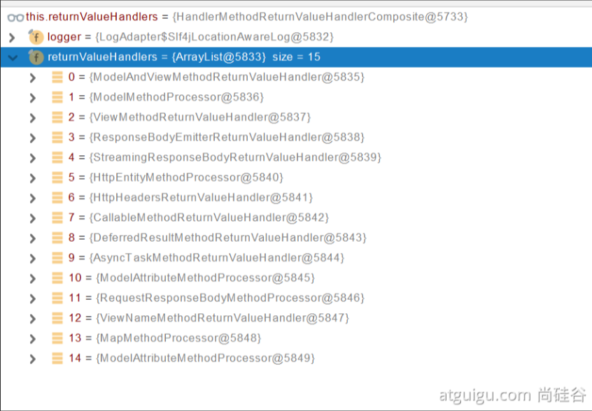

   ```java
   try {
       this.returnValueHandlers.handleReturnValue(
           returnValue, getReturnValueType(returnValue), mavContainer, webRequest);
   }
   ```

   ```java
   @Override
   public void handleReturnValue(@Nullable Object returnValue, MethodParameter returnType,
   			ModelAndViewContainer mavContainer, NativeWebRequest webRequest) throws Exception {
       HandlerMethodReturnValueHandler handler = selectHandler(returnValue, returnType);
   	if (handler == null) {
   		throw new IllegalArgumentException("Unknown return value type: " + returnType.getParameterType().getName());
   	}
   	handler.handleReturnValue(returnValue, returnType, mavContainer, webRequest);
   }
   ```

   ```java
   RequestResponseBodyMethodProcessor  	
   @Override
   	public void handleReturnValue(@Nullable Object returnValue, MethodParameter returnType,
   			ModelAndViewContainer mavContainer, NativeWebRequest webRequest)
   			throws IOException, HttpMediaTypeNotAcceptableException, HttpMessageNotWritableException {
   
   		mavContainer.setRequestHandled(true);
   		ServletServerHttpRequest inputMessage = createInputMessage(webRequest);
   		ServletServerHttpResponse outputMessage = createOutputMessage(webRequest);
   
   		// Try even with null return value. ResponseBodyAdvice could get involved.
           // 使用消息转换器进行写出操作
   		writeWithMessageConverters(returnValue, returnType, inputMessage, outputMessage);
   	}
   ```

   

2. **返回值解析器原理**

   

- 返回值处理器判断是否支持这种类型返回值——supportsReturnType
- 返回值处理器调用 handleReturnValue 进行处理
- RequestResponseBodyMethodProcess可以处理返回值标了@ResponseBody注解的
  - 利用MessageConverter进行处理 将数据写为json
    - 内容协商（==**浏览器默认会以请求头的方式告诉服务器他能接受什么样的内容类型**==）
    - 服务器最终根据自己自身的能力，决定服务器能生产出什么样的内容类型的数据
    - SpringMVC会挨个遍历所有容器底层的HttpMessageConverter看谁能处理
      - 得到MappingJackson2HttpMessageConverter可以将对象象写为json
      - 利用MappingJackson2HttpMessageConverter将对象转为JSON再写进去


##### 2、SpringMVC到底支持哪些返回值

```properties
ModelAndView
Model
View
ResponseEntity 
ResponseBodyEmitter
StreamingResponseBody
HttpEntity
HttpHeaders
Callable
DeferredResult
ListenableFuture
CompletionStage
WebAsyncTask
有 @ModelAttribute 且为对象类型的
@ResponseBody 注解 ---> RequestResponseBodyMethodProcessor；
```

##### 3、HTTPMessageConverter原理

1. **MessageConverter规范**

   

   HttpMessageConverter：看是否支持将此class类型的对象，转为MediaType类型的数据

   例如：Person转为JSON。或者JSON转为Person

2. **默认的MessageConverter**

   

0-只支持Byte类型

1-String

2-String

3-Resource

4-ResourceRegion

5-DOMSource.**class **   \  SAXSource.**class**) \ StAXSource.**class **  \ StreamSource.**class ** \Source.**class**

**6 -** MultiValueMap

7 - **true** 

**8 - true**

**9 - 支持注解方式xml处理的。**


最终MappingJackson2HttpMessageConverter 把对象转为JSON （利用底层的Jackson的objectMapper转换的）


#### 4.2、内容协商

**根据客户端接受能力不同，返回不同媒体类型的数据**

##### 1、引入xml依赖

```xml
 <dependency>
     <groupId>com.fasterxml.jackson.dataformat</groupId>       
     <artifactId>jackson-dataformat-xml</artifactId>
</dependency>
```

##### 2、postman分别测试返回json和xml

只需要改变请求头中Accept字段。Http协议规定的，告诉服务器本客户端可以接受的数据类型

##### 3、开启浏览器参数方式内容协商功能

为了方便内容协商，开启基于请求参数的内容协商功能

```YAML
spring:
	contentnegotiation:
		favor-parameter: true  #开启请求参数内容协商模式
```

发请求： http://localhost:8080/test/person?format=json

​				[http://localhost:8080/test/person?format=](http://localhost:8080/test/person?format=json)xml


确定客户端接受什么样的内容类型

1. Parameter策略优先确定是要返回json数据（获取请求头中的format的值）
2. 最终进行内容协商返回客户端JSON即可


##### 4、内容协商原理

1. 判断当前响应头中是否已经有确定的媒体类型。MediaType

2. 获取客户端（PostMan、浏览器）支持接受的内容类型。（获取客户端Accept请求头字段）【application/xml】

   - contentNegotiatingManager内容协商管理器 默认使用基于请求头的策略

   - HeaderContentNegotiatingStrategy 确定客户端可以接受的内容类型

3. 遍历循环所有当前系统的MessageConverter，看谁支持操作这个对象（Person）

4. 找到支持操作Person的Converter，把Converter支持的媒体类型统计出来

5. 客户端需要【application/xml】。服务端能力【10种，json，xml】

6. 进行内容协商的最佳匹配媒体类型

7. 用支持将对象转换为最佳匹配媒体类型的Converter，调用它进行转换


导入了Jackson处理xml的包、xml的Converter会自动进来

```java
// 在类WebMvcConfigurationSupport中
jackson2XmlPresent = ClassUtils.isPresent("com.fasterxml.jackson.dataformat.xml.XmlMapper", classLoader);

if (jackson2XmlPresent) {
			Jackson2ObjectMapperBuilder builder = Jackson2ObjectMapperBuilder.xml();
			if (this.applicationContext != null) {
				builder.applicationContext(this.applicationContext);
			}
			messageConverters.add(new MappingJackson2XmlHttpMessageConverter(builder.build()));
		}
```


##### 5、自定义MessageConverter

实现多协议数据兼容。json、xml、x-guigu（自定义app）

1. @ResponseBody响应数据出去 调用 RequestResponseBodyMethodProcessor处理
2. Processor处理方法返回值。通过MessageConverter处理
3. 所有 MessageConverter合起来可以支持个媒体类型数据的操作（读、写）
4. 内容协商找到最终的MessageConverter


SpringMVC的什么功能。一个入口给容器中添加一个 WebMvcConfigurer

```java
 @Bean
    public WebMvcConfigurer webMvcConfigurer(){
        return new WebMvcConfigurer() {

            @Override
            public void extendMessageConverters(List<HttpMessageConverter<?>> converters) {

            }
        }
    }
```


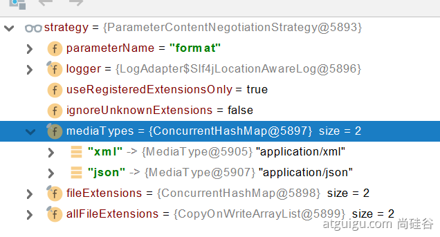


**有可能我们添加的自定义的功能会覆盖很多功能，导致一些默认的功能失效**

**大家考虑，上述功能除了我们完全自定义外？SpringBoot有没有为我们提供基于配置文件的快速修改媒体类型功能？怎么配置呢？【提示：参照SpringBoot官方文档web开发内容协商章节】**


需求：

1. 如果浏览器发起请求直接返回xml——[appliction/xml]——jacksonxmlConverter

2. 如果是ajax请求，返回JSON——[application/json]——jacksonJsonConveter

3. 如果是自己的app发请求，返回自定义协议数据

   步骤

   1. 添加自定义的MessageConverter进系统底层
   2. 系统底层就会统计出所有MessageConverter能操作哪些类型
   3. 客户端内容协商


### 5、视图解析与模板引擎

**视图解析：SpringBoot默认==不支持JSP==，需要引入第三方模板引擎技术实现页面渲染**


#### 5.1、视图解析

##### 1、视图解析原理流程

1. 目标方法处理过程中，所有的数据都会呗放在ModelAndViewContainer里面。包括数据和视图地址
2. 方法的参数是一个自定义类型对象（从请求参数中确定的）。把他重新放在ModelAndViewContainer
3. 任何目标方法执行完成以后都会返回ModelAndView（数据和视图地址）。
4. processDispatchResult 处理派发结果（页面如何响应）
   1. render（mv，request，response）；进行页面渲染逻辑
      1. 根据方法的String返回值得到View对象【定义了页面的渲染逻辑】
      2. 所有的视图解析器尝试是否能根据当前返回值得到View对象
      3. 得到了 redirect:/main.html  --》 Thymeleaf new RedirectView()
      4. ContentNegotiationViewResolver 里面包含了下面所有的视图解析器，内部还是利用下面所有视图解析器得到视图对象。
      5. View.render(mv.getModelInternal(), request, response)；视图调用自定义的render进行页面渲染工作
         1. **RedirectView 如何渲染【重定向到一个页面】**
         2. **获取目标url地址**
         3. **response.sendRedirect(encodedURL);**
         4. - - 

视图解析：

- 返回值以forward: 开始：new InternalResourceView(forwardURL)； --》 **转发request.getRequestDispatcher(path).forward(request, response);** 
- **返回值以redirect：开始：new RedirectView() --》 render就是重定向** 
- 返回值是普通字符串： new Thymeleaf（）-->

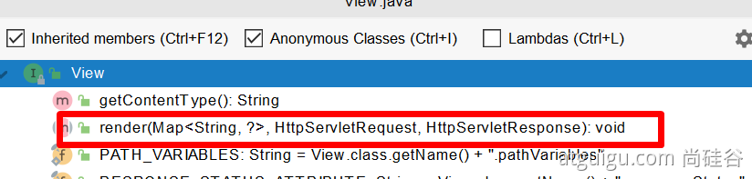


#### 5.2、模板引擎-Thymeleaf

##### 1、Thymeleaf简介

Thymeleaf is a modern server-side Java template engine for both web and standalone environments, capable of processing HTML, XML, JavaScript, CSS and even plain text.

https://www.thymeleaf.org/

**现代化、服务端Java模板引擎**


##### 2、基本语法

###### 1、表达式

| 表达式名字 | 语法    | 用途                               |
| ---------- | ------- | ---------------------------------- |
| 变量取值   | \${···} | 获取请求域、session域、对象等值    |
| 选择变量   | \*{···} | 获取上下文对象值                   |
| 消息       | #{···}  | 获取国际化等值                     |
| 链接       | @{···}  | 生成链接                           |
| 片段表达式 | ~{····} | jsp:include 作用，引入公共页面片段 |

###### 2、字面量

文本值：**'one text'，'Auother one!'**

数字：**0，34，3.0**

布尔值：**true，false**

空值：**null**

变量：**one，two**，==变量不能有空格==

###### 3、文本操作

字符串拼接：**+**

变量替换：**|The name is ${name}|**

###### 4、数学运算

运算符：**+、-、*、/、%**

###### 5、布尔运算

运算符：**and、or**

一元运算：**!、not**

###### 6、比较运算

比较: **>** **,** **<** **,** **>=** **,** **<=** **(** **gt** **,** **lt** **,** **ge** **,** **le** **)**

等式: **==** **,** **!=** **(** **eq** **,** **ne** **)** 

###### 7、条件运算

If-then: **(if) ? (then)**

If-then-else: **(if) ? (then) : (else)**

Default: (value) **?: (defaultvalue)** 

###### 8、特殊操作

无操作： _


##### 3、设置属性-th:attr

设置单个值

```html
<form action="subscribe.html" th:attr="action=@{/subscribe}">
  <fieldset>
    <input type="text" name="email" />
    <input type="submit" value="Subscribe!" th:attr="value=#{subscribe.submit}"/>
  </fieldset>
</form>
```

设置多个值

```HTML

```

以上两个的代替写法 **th:xxxx**

```HTML
<input type="submit" value="Subscribe!" th:value="#{subscribe.submit}"/>
<form action="subscribe.html" th:action="@{/subscribe}">
```

所有h5兼容的标签写法

https://www.thymeleaf.org/doc/tutorials/3.0/usingthymeleaf.html#setting-value-to-specific-attributes


##### 4、迭代

```HTML
<tr th:each="prod : ${prods}">
        <td th:text="${prod.name}">Onions</td>
        <td th:text="${prod.price}">2.41</td>
        <td th:text="${prod.inStock}? #{true} : #{false}">yes</td>
</tr>
```

```HTML
<tr th:each="prod,iterStat : ${prods}" th:class="${iterStat.odd}? 'odd'">
  <td th:text="${prod.name}">Onions</td>
  <td th:text="${prod.price}">2.41</td>
  <td th:text="${prod.inStock}? #{true} : #{false}">yes</td>
</tr>
```


##### 5、条件运算

```html
<a href="comments.html"
th:href="@{/product/comments(prodId=${prod.id})}"
th:if="${not #lists.isEmpty(prod.comments)}">view</a>
```

```html
<div th:switch="${user.role}">
  <p th:case="'admin'">User is an administrator</p>
  <p th:case="#{roles.manager}">User is a manager</p>
  <p th:case="*">User is some other thing</p>
</div>
```


##### 6、属性优先级


#### 5.3、Thymeleaf的使用

##### 1、引入Starter

```xml
<dependency>
    <groupId>org.springframework.boot</groupId>
    <artifactId>spring-boot-starter-thymeleaf</artifactId>
</dependency>
```


##### 2、自动配置好了Thymeleaf

```java
@Configuration(proxyBeanMethods = false)
@EnableConfigurationProperties(ThymeleafProperties.class)
@ConditionalOnClass({ TemplateMode.class, SpringTemplateEngine.class })
@AutoConfigureAfter({ WebMvcAutoConfiguration.class, WebFluxAutoConfiguration.class })
public class ThymeleafAutoConfiguration { }
```

自动配置好的策略

1. 所有的Thymeleaf的配置都在ThymeleafProperties
2. 配置好了**SpringTemplateEngine**
3. 配好了**ThymeleafViewResolver**
4. 我们只需要直接开发页面

```java
// 默认前缀 templates
public static final String DEFAULT_PREFIX = "classpath:/templates/";
// 默认后缀 html
public static final String DEFAULT_SUFFIX = ".html";  //xxx.html
```


##### 3、页面开发

```java
@Controller
public class ViewTestController {

    @GetMapping("/atguigu")
    public String atguigu(Model model){
//        model 中的数据会被放在请求域中
        model.addAttribute("msg","你好，硅谷");
        model.addAttribute("link", "https://www.baidu.com");
        return "success";
    }
}
```

```html
<!DOCTYPE html>
<!--添加名称空间-->
<html lang="en" xmlns:th="http://www.thymeleaf.org">
<head>
    <meta charset="UTF-8">
    <title>Title</title>
</head>
<body>
<h1 th:text="${msg}">哈哈</h1>
<h2>
    <!--href值被替换为 https://www.baidu.com-->
    <a href="www.atguigu.com" th:href="${link}">去百度</a>  <br/>
    <!--href值被替换为 link-->
    <a href="www.atguigu.com" th:href="@{link}">去百度2</a>
</h2>
</body>
</html>
```

```yaml
# 配置项目访问路径前缀
server:
	servlet:
		context-path: /world
```


#### 5.4、构建后台管理系统

##### 1、项目创建

Thymeleaf、web-starter、devtools、lombok

##### 2、静态资源处理

自动配置好，我们只需要把所有的静态资源放在static文件夹下

##### 3、路径构建

th:action="@{/login}"

##### 4、模板抽取

th:insert/replace/include

方式：

1. 引入使用  th:insert="~{公共页面名 :: 选择器}"  【或用replace、include】

   ~~~html
   <!--公共页面 root.html-->
   ···
   <div id="copy-section">
       ```
   </div>
   ···
   ~~~

   ```html
   <div th:insert="~{root :: #copy-section}">
       
   </div>
   ```

2. 公共页面在定义 th:fragment="value"，引入使用 th:insert="~{页面名 :: value}" 【或用replace、include】

   ~~~html
   <!--公共页面 root.html-->
   ···
   <div th:fragment="copy">
       ```
   </div>
   ···
   ~~~

   ```html
   <div th:insert="~{root :: copy}">
       
   </div>
   ```


==insert、replace、include的区别==

th:insert	插入片段，**保留自身标记**

th:replace	插入片段，**替换了自身标记**

th:include	插入片段的内容，**去掉片段外层标记，同时保留自身标记**

比如有这个公共页面

```html
<footer th:fragment="copy">
  &copy; 2011 The Good Thymes Virtual Grocery
</footer>
```

然后分别用insert、replace、include来引用：

```html
<body>
  <div th:insert="footer :: copy"></div>
  <div th:replace="footer :: copy"></div>
  <div th:include="footer :: copy"></div>
</body>
```

运行结果为

```html
<body>
  <div>
    <footer>
      &copy; 2011 The Good Thymes Virtual Grocery
    </footer>
  </div>

  <footer>
    &copy; 2011 The Good Thymes Virtual Grocery
  </footer>

  <div>
    &copy; 2011 The Good Thymes Virtual Grocery
  </div>
</body>
```


##### 5、页面跳转

```java 
@PostMapping("/login")
public String main(User user, HttpSession session, Model model){
    if(StringUtils.hashLength(user.getUserName()) && "123456".equals(user.getPassword())){
        // 把登录成功的用户保存起来
        session.setAttribute("loginUser",user);
        // 登录成功重定向到main.html 重定向防止表单重复提交
        return "redirect:/main.html"
    }else{
        model.addAttribute("msg","账号密码错误");
        // 返回到登录页面
        return "login";
    }
}
```

##### 6、数据渲染

```java 
@GetMapping("/dynamic_table")
public String dynamic_table(Model model){
    //表格内容的遍历
    List<User> users = Arrays.asList(new User("zhangsan", "123456"),
            new User("lisi", "123444"),
            new User("haha", "aaaaa"),
            new User("hehe ", "aaddd"));
    model.addAttribute("users",users);

    return "table/dynamic_table";
}
```

```java 
<table class="display table table-bordered" id="hidden-table-info">
<thead>
<tr>
    <th>#</th>
    <th>用户名</th>
    <th>密码</th>
</tr>
</thead>
<tbody>
<tr class="gradeX" th:each="user,stats:${users}">
    <td th:text="${stats.count}">Trident</td>
    <td th:text="${user.userName}">Internet</td>
    <td >[[${user.password}]]</td>
</tr>
</tbody>
</table>
```


### 6、拦截器

#### 6.1、HandlerIntercepto接口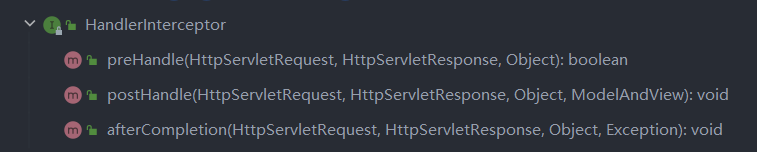

```java
/**
 * 登录检查
 * 1、配置好拦截器要拦截哪些请求
 * 2、把这些配置放在容器中
 * 3、实现HandlerInterceptor接口
 */
@Slf4j
public class LoginInterceptor implements HandlerInterceptor {

    /**
     * 目标方法执行之前
     * @param request
     * @param response
     * @param handler
     * @return
     * @throws Exception
     */
    @Override
    public boolean preHandle(HttpServletRequest request, HttpServletResponse response, Object handler) throws Exception {

        String requestURI = request.getRequestURI();
        log.info("preHandle拦截的请求路径是{}",requestURI);

        //登录检查逻辑
        HttpSession session = request.getSession();

        Object loginUser = session.getAttribute("loginUser");

        if(loginUser != null){
            //放行
            return true;
        }

        //拦截住。未登录。跳转到登录页
        request.setAttribute("msg","请先登录");
//        re.sendRedirect("/");
        request.getRequestDispatcher("/").forward(request,response);
        return false;
    }

    /**
     * 目标方法执行完成以后
     * @param request
     * @param response
     * @param handler
     * @param modelAndView
     * @throws Exception
     */
    @Override
    public void postHandle(HttpServletRequest request, HttpServletResponse response, Object handler, ModelAndView modelAndView) throws Exception {
        log.info("postHandle执行{}",modelAndView);
    }

    /**
     * 页面渲染以后
     * @param request
     * @param response
     * @param handler
     * @param ex
     * @throws Exception
     */
    @Override
    public void afterCompletion(HttpServletRequest request, HttpServletResponse response, Object handler, Exception ex) throws Exception {
        log.info("afterCompletion执行异常{}",ex);
    }
}
```


#### 6.2、配置拦截器

```java
/**
 * 1、编写一个拦截器实现HandlerInterceptor接口
 * 2、拦截器注册到容器中（实现WebMvcConfigurer的addInterceptors）
 * 3、指定拦截规则【如果是拦截所有，静态资源也会被拦截】
 */
@Configuration
public class AdminWebConfig implements WebMvcConfigurer {

    @Override
    public void addInterceptors(InterceptorRegistry registry) {
        registry.addInterceptor(new LoginInterceptor())
                .addPathPatterns("/**")  //所有请求都被拦截包括静态资源
                .excludePathPatterns("/","/login","/css/**","/fonts/**","/images/**","/js/**"); //放行的请求
    }
}
```


#### 6.3、拦截器原理

1. 根据当前请求，找到**HandlerExecutionChain**【可以处理请求的Handler以及Handler的所有拦截器】
2. 先来**顺序执行**所有拦截器的**preHandle**方法
   1. 如果当前拦截器preHandle返回true。则执行下一个拦截器的preHandle
   2. 如果当前拦截器返回为false。直接**倒序执行**所有已经执行了的拦截器的**afterCompletion**
3. **如果任何一个拦截器返回false。直接跳出不执行目标方法**
4. **所有拦截器都返回True。执行目标方法**
5. **倒序执行所有拦截器的postHandle方法**
6. 前面的步骤任何异常都会直接倒序触发afterCompletion
7. 页面成功渲染完成以后也会倒序触发afterCompletion


### 7、文件上传

#### 7.1、页面表单

```html
<!--
	文件上传三个必须条件
	1、form表单为 POST 请求，enctype值为multipart/form-data
	2、input 类型为 file
	3、使用submit提交
	4、input 添加 multiple 属性为多文件上传
-->
<form method="post" action="/upload" enctype="multipart/form-data">
    <input type="file" name="file"><br>
    <input type="submit" value="提交">
</form>
```


#### 7.2、文件上传代码

```java
    /**
     * MultipartFile 自动封装上传过来的文件
     * @param email
     * @param username
     * @param headerImg
     * @param photos
     * @return
     */
    @PostMapping("/upload")
    public String upload(@RequestParam("email") String email,
                         @RequestParam("username") String username,
                         @RequestPart("headerImg") MultipartFile headerImg,
                         @RequestPart("photos") MultipartFile[] photos) throws IOException {

        log.info("上传的信息：email={}，username={}，headerImg={}，photos={}",
                email,username,headerImg.getSize(),photos.length);

        if(!headerImg.isEmpty()){
            //保存到文件服务器，OSS服务器
            //获取文件名
            String originalFilename = headerImg.getOriginalFilename();
            //保存到指定路径
            headerImg.transferTo(new File("H:\\cache\\"+originalFilename));
        }

        if(photos.length > 0){
            for (MultipartFile photo : photos) {
                if(!photo.isEmpty()){
                    String originalFilename = photo.getOriginalFilename();
                    photo.transferTo(new File("H:\\cache\\"+originalFilename));
                }
            }
        }


        return "main";
    }

```


注意：

1. 默认情况下

   1. 单个文件最大为 1MB
   2. 最大的请求大小为 10

2. 修改限制文件大小

   ```properties
   spring.servlet.multipart.max-file-size=10MB
   spring.servlet.multipart.max-request-size=100MB
   ```

   


#### 7.3、自动配置原理

文件上传自动配置类——MultipartAutoConfiguration-MultipartProperties

- 自动配置好了StandardServletMultipartResolver【文件上传解析器】

- 原理步骤

  1. 请求进来使用文件上传解析器判断（isMultipart）并封装（resolveMultipart，返回MultipartHttpServletRequest）文件上传请求
  2. 参数解析器来解析请求中的文件内容封装成MultipartFile
  3. 将request中文件信息封装为一个Map；MultiValueMap<String，MultipartFile>

  FileCopyUtils。实现文件流拷贝

  ```java
      @PostMapping("/upload")
      public String upload(@RequestParam("email") String email,
                           @RequestParam("username") String username,
                           @RequestPart("headerImg") MultipartFile headerImg,
                           @RequestPart("photos") MultipartFile[] photos)
  ```

  


### 8、异常处理

#### 8.1、错误处理

##### 1、默认规则

- 默认情况下，SpringBoot提供 **/error** 处理所有错误的映射

- 对于机器客户端，它将生成JSON响应 ，其中包含错误，HTTP状态和异常消息的详细信息。对于浏览器客户端，响应一个 “whitelabel” 错误视图，以HTML格式呈现相同的数据

  

- **要对其进行自定义，添加View解析为error**
- 要完全替代默认行为，可以实现 ErrorController 并注册该类型的Bean定义。或添加 ErrorAttributes 类型的组件以使用现有机制但替换其内容
- **error / 下的4xx，5xx页面会被自动解析**【或者在静态资源下的error下】

- **取出错误信息  \${json的key键}**


##### 2、定制错误处理逻辑

- 自定义错误页
  - error/4xx.html   err/5xxx.html   【可位于模板引擎中或者静态资源中】；有精确的错误状态码页面就匹配精确，没有就找4xx.html；如果都没有就会触发空白页
- @ControllerAdvice  +  @ExceptionHandler处理全局异常；底层是ExceptionHandlerExceptionResolver支持的
- @ResponseStatus + 自定义异常；底层是ResponseStatusExceptionResolver，把ResponseStatus注解的信息底层调用response.sendError(statusCode,resolvedReason)；tomcat发送的 /error
- Spring底层的异常，如 参数类型转换异常；**DefaultHandlerExceptionResolver 处理框架底层的异常。**
  - response.sendError(HttpServletResponse.**SC_BAD_REQUEST**, ex.getMessage()); 
- 自定义实现HandlerExceptionResolver处理异常；可以作为默认的全局异常处理规则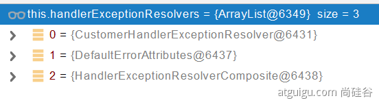


##### 3、异常处理自动配置原理

- ErrorMVCAutoConfiguration 自动配置异常处理规则

  - 容器中的组件：类型：DefaultErrorAttributes -> id:errorAttributes

    - public class DefaultErrorAttributes implements

      ErrorAttributes，HandlerExceptionResolver

    - DefaultErrorAttributes；定义错误页面中可以包含哪些数据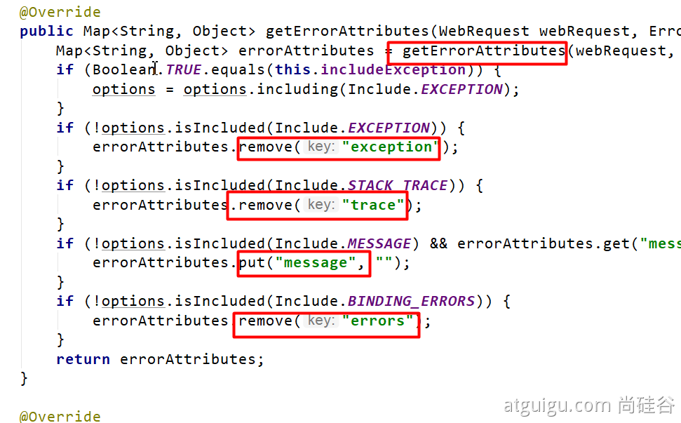

    - 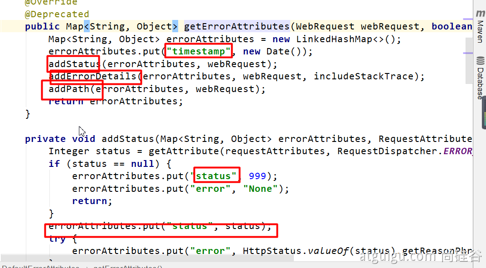

  - 容器中的组件：类型：BasicErrorController  --> id:basicErrorController (json+空白页  适配响应)
    - 处理默认  /error 路径的请求；页面响应 new ModelAndView ("error",model);
    - 容器中有组件 view -> id是error；（响应默认错误页）
    - 容器放组件 BeanNameViewResolver（视图解析器）按照返回的视图名作为组件的id去容器中找view对象
  - 容器中的组件：类型DefaultErrorViewResolver  -> id ：conventionErrorViewResolver
    - 如发生错误，会以HTTP的状态码作为视图页地址（viewName），找到真正的页面
    - error/404 、5xx.html

如果想要返回页面；就会找error视图【**StaticView**】。(默认是一个白页)

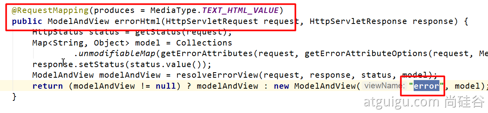


##### 4、异常处理步骤流程

1. 执行目标方法，目标方法运行期间有任何异常都会呗catch、而且标志当前请求结束；并且用dispatchException
2. 进入视图解析流程（页面渲染？）
   1. processDispatchResult(processedRequest, response, mappedHandler, **mv**, **dispatchException**);
3. **mv** = **processHandlerException**；处理handler发生的异常，处理完成返回ModelAndView；
   1. 遍历所有的HandlerExceptionResolver，看谁处理当前异常【**HandlerExceptionResolver处理器异常解析器**】
   2. 系统默认的异常解析器
      1. **DefaultErrorAttributes先来处理异常。把异常信息保存到rrequest域，并且返回null；**
      2. **DefaultErrorAttributes先来处理异常。把异常信息保存到rrequest域，并且返回null；**
         1. **如果没有任何人能处理最终底层就会发送 /error 请求。会被底层的BasicErrorController处理**
         2. **解析错误视图；遍历所有的**  **ErrorViewResolver  看谁能解析。**
         3. **默认的** **DefaultErrorViewResolver ,作用是把响应状态码作为错误页的地址，error/500.html** 
         4. **默认的** **DefaultErrorViewResolver ,作用是把响应状态码作为错误页的地址，error/500.html** 


### 9、Web原生组件注入（Servlet、Filter、Listener）

#### 9.1、使用ServletAPI

@ServletComponentScan(basePackages = "com.atguigu.admin")：制定原生Servlet组件都放在哪里  【放在启动类application】

@WebServlet(urlPatterns = "/my")：效果：直接响应，没有经过Spring的拦截器

@WebFilter(urlPatterns = {"/css/\**" , "/images/\**"})

@WebListener


推荐可以使用这种方式

扩展：DispatcherServlet如何注册进来

- 容器中自动配置了DispatchServlet属性绑定到WebMvcProperties；对应的配置文件置顶是spring.mvc
- 通过ServletRegistrationBean\<DispatcherServlet> 把DispatcherServlet配置进来
- 默认映射的是 / 路径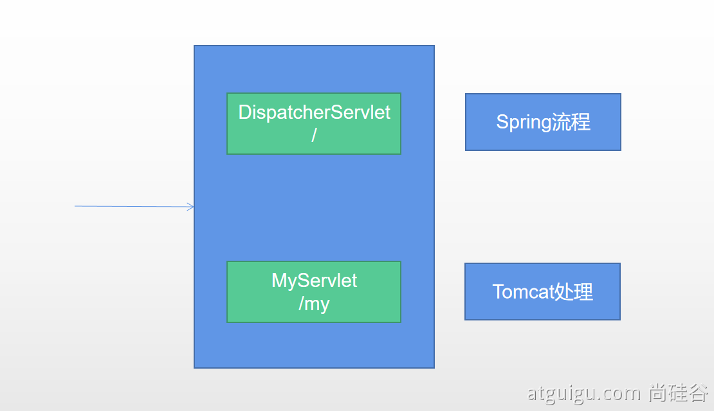


Tomcat-Servlet；

多个Servlet都能处理到同一层路径，精确优选原则

A： /my/

B： /my/1


#### 9.2、使用RegistrationBean

`ServletRegistrationBean`, `FilterRegistrationBean`, `and ServletListenerRegistrationBean`

```java 
@Configuration
public class MyRegistConfig{
    
    @Bean
    public ServletRegistrationBean myServlet(){
        MyServlet myServlet = new MyServlet();
        return new ServletRegistrationBean(myServlet,"/my","/my02");
    }
    
    @Bean
    public FilterRegistrationBean myFilter(){
        MyFilter myFilter = new MyFliter();
        FilterRegistrationBean filterRegistrationBean = new FilterRegistrationBean(myFilter);
        filterRegistrationBean.setUrlPatterns(Arrays.asList("/my","/css/*"));
        return filterRegistrationBean;
    }
    
    @Bean
    public ServletListenerRegistrationBean myListener(){
        MySwervletContextListener mySwervletContextListener = new MySwervletContextListener();
        return new ServletListenerRegistrationBean(mySwervletContextListener);
    }
}
```


### 10、嵌入式Servlet容器

#### 10.1、切换嵌入式Servlet容器

- 默认支持的webServer
  - `Tomcat`、`Jetty`、`Undertow`
  - ServletWebServletApplicationContext容器启动寻找ServletWebServerFactory并引导创建服务器
- 切换服务器

```xml
<dependency>
    <groupId>org.springframework.boot</groupId>
    <artifactId>spring-boot-starter-web</artifactId>
    <exclusions>
        <exclusion>
            <groupId>org.springframework.boot</groupId>
            <artifactId>spring-boot-starter-tomcat</artifactId>
        </exclusion>
    </exclusions>
</dependency>
```

- 原理
  - SpringBoot应用启动发现当前是Web项目。web场景包-导入tomcat
  - web应用会创建一个web版本的ioc容器 ServletWebServerApplicationContext
  - ServletWebServerApplicationContext 启动的时候寻找 ServletWebServerFactory  （Servlet 的web服务器工厂 --> servlet 的web服务器）
  - SpringBoot底层默认有很多的WebServer工厂； TomcatServletWebServerFactory、JettyServletWebServerFactory、UndertowServletWebServerFactory
  - 底层直接会有一个自动配置类。ServletWebServerFactoryAutoConfiguration
  - ServletWebServerFactoryAutoConfiguration 导入了 ServletWebServerFactoryConfiguration （配置类）
  - TomcatServletWebServerFactory 创建出Tomcat服务器并启动；TomcatWebServer 的构造器拥有初始化方法initialize---this.tomcat.start();
  - 内嵌服务器，就是手动把启动服务器的代码调用（tomcat核心jar包存在）


#### 10.2、定制Servlet容器

- 实现**WebServerFactoryCu**stomizer\<ConfigurableServletWebServerFactory>
  - 把配置文件的值和ServletWebServerFactory进行绑定
- 修改配置文件server.xxxx
- 直接定义 ConfigurableServletWebServerFactory

xxxxCustomizer：定制化器，可以改变xxx的默认规则

```java
import org.springframework.boot.web.server.WebServerFactoryCustomizer;
import org.springframework.boot.web.servlet.server.ConfigurableServletWebServerFactory;
import org.springframework.stereotype.Component;

@Component
public class CustomizationBean implements WebServerFactoryCustomizer<ConfigurableServletWebServerFactory> {

    @Override
    public void customize(ConfigurableServletWebServerFactory server) {
        server.setPort(9000);
    }

}
```


### 11、定制化原理

#### 11.1、定制化的常见方式

- 修改配置文件

- xxxxCustomizer

- 编写自定义的配置类  xxxConfiguration；+ @Bean替换、增加容器中默认组件；视图解析器

- web应用编写一个配置类实现WebMvcConfigurer即可定制化web功能； + @Bean给容器中再扩展一些组件

  ```java
  @Configuration
  public class AdminWebConfig implements WebMvcConfigurer
  ```

- @EnableWebMvc + WebMvcConfigurer —— @Bean 可以全面接管SpringMVC，所有规则全部自己重新配置；实现定制和扩展功能

  - 原理
  - WebMvcAutoConfiguration 默认的SpringMVC的自动配置功能类。静态资源、欢迎页······
  - 一旦使用 @EnableWebMvc   会   @Import(DelegatingWebMvcConfiguration.class)
  - DelegatingWebMvcConfiguration 的作用，只保证SpringMVC最基本的使用
    - 把所有系统中的WebMvcConfigurer拿过来。所有功能的定制都是这些WebMVCConfigurer 合起来一起生效
    - 自动配置了一些非常底层的组件 RequestMappingHandlerMapping 这些组件依赖的组件都是从容器中获取
    - public class DelegatingWebMvcConfiguration extends WebMvcConfigurationSupport
  - WebMvcAutoConfiguration里面的配置要能生效必须 @ConditionalOnMissingBean(WebMvcConfigurationSupport.class)
  - @EnableWebMvc导致了WebMVCAutoConfiguration 没有生效


#### 11.2、原理分析套路

**场景starter** **- xxxxAutoConfiguration - 导入xxx组件 - 绑定xxxProperties --** **绑定配置文件项** 


## 六、数据访问

### 1、SQL

#### 1.1、数据源的自动配置-HikariDataSource

##### 1、导入JDBC场景

```xml
<dependency>
    <groupId>org.springframework.boot</groupId>
    <artifactId>spring-boot-starter-data-jdbc</artifactId>
</dependency>
```


数据库驱动？

为什么官方导入JDBC场景，官方不导入驱动？官方不知道我们接下来要操作什么数据库。

**数据库版本和驱动版本对应**

```xml
<!--官方默认版本：-->
<mysql.version>8.0.22</mysql.version>
        <dependency>
            <groupId>mysql</groupId>
            <artifactId>mysql-connector-java</artifactId>
<!--            <version>5.1.49</version>-->
        </dependency>

<!--
想要修改版本（两张方法）
1、直接依赖引入具体版本（maven的就近依赖原则）
2、重新声明版本（maven的属性的就近优先原则）
-->
    <properties>
        <java.version>1.8</java.version>
        <mysql.version>5.1.49</mysql.version>
    </properties>
```


##### 2、分析自动配置

**自动配置的类**

- DataSourceAutoConfiguration：数据源的自动配置

  - 修改数据源相关的配置：**spring.dataSource**
  - **数据库连接池的配置，是自己容器中没有DataSource才自动配置的**
  - 底层配置好的连接池是：**==HikariDataSource==**

  ```java
  @Configuration(proxyBeanMethods = false)
  @Conditional(PooledDataSourceCondition.class)
  @ConditionalOnMissingBean({ DataSource.class, XADataSource.class })
  @Import({ DataSourceConfiguration.Hikari.class, DataSourceConfiguration.Tomcat.class,
  		DataSourceConfiguration.Dbcp2.class, 
          DataSourceConfiguration.OracleUcp.class,
  		DataSourceConfiguration.Generic.class, DataSourceJmxConfiguration.class })
  protected static class PooledDataSourceConfiguration
  ```

- DataSourceTransactionManagerAutoConfiguration：事务管理器的自动配置

- JdbcTemplateAutoConfiguration：**JdbcTemplate的自动配置，可以来数据库进行crud**

  - 可以修改这个配置项**@ConfigurationProperties(prefix = "spring.jdbc")**来修改**JdbcTemplate**
  - @Bean@Primary    JdbcTemplate；容器中有这个组件

- JndiDataSourceAutoConfiguration： jndi的自动配置

- XADataSourceAutoConfiguration： 分布式事务相关的


##### 3、修改配置项

```yaml
spring:
  datasource:
    url: jdbc:mysql://localhost:3306/db_account
    username: root
    password: 123456
    driver-class-name: com.mysql.jdbc.Driver
```


##### 4、测试

```java
@Slf4j
@SpringBootTest
class Boot05WebAdminApplicationTests{
    
    @Autowired
    JdbcTemplate jdbcTemplate;
    
    @Test
    void contextLoads(){
//        jdbcTemplate.queryForObject("select * from account_tbl")
//        jdbcTemplate.queryForList("select * from account_tbl",)
        Long aLong = jdbcTemplate.queryForObject("select count(*) from account_tbl", 
                                                 Long.class);
        log.info("记录总数：{}",aLong);
    }
        
}
```


#### 1.2、使用Druid数据源

##### 1、druid官方GitHub地址

https://github.com/alibaba/druid

整合第三方技术的两种方式

- 自定义
- 找starter


##### 2、自定义方式

1. **创建数据源**

   ```xml
   <dependency>
       <groupId>com.alibaba</groupId>
       <artifactId>druid</artifactId>
       <version>1.1.17</version>
   </dependency>
   
   <!--Spring原生办法；SpringBoot使用配置类的方式-->
   <bean id="dataSource" class="com.alibaba.druid.pool.DruidDataSource"
   		destroy-method="close">
   		<property name="url" value="${jdbc.url}" />
   		<property name="username" value="${jdbc.username}" />
   		<property name="password" value="${jdbc.password}" />
   		<property name="maxActive" value="20" />
   		<property name="initialSize" value="1" />
   		<property name="maxWait" value="60000" />
   		<property name="minIdle" value="1" />
   		<property name="timeBetweenEvictionRunsMillis" value="60000" />
   		<property name="minEvictableIdleTimeMillis" value="300000" />
   		<property name="testWhileIdle" value="true" />
   		<property name="testOnBorrow" value="false" />
   		<property name="testOnReturn" value="false" />
   		<property name="poolPreparedStatements" value="true" />
   		<property name="maxOpenPreparedStatements" value="20" />
   </bean>
   ```

   

   **SpringBoot处理方法**

   ```java
   @Configuration
   public class MyDataSourceConfig {
   
       @Bean
       //绑定配置文件信息，获取连接数据库信息
       @ConfigurationProperties("spring.datasource")
       public DataSource dataSource(){
           return new DruidDataSource();
       }
   }
   
   ```

   

2. **StatViewServlet**

   > StatViewServlet的用途包括：
   >
   > - 提供监控信息展示的HTML页面
   > - 提供监控信息的JSON API

   ```xml
   <servlet>
   	<servlet-name>DruidStatView</servlet-name>
   	<servlet-class>com.alibaba.druid.support.http.StatViewServlet</servlet-class>
   </servlet>
   <servlet-mapping>
   	<servlet-name>DruidStatView</servlet-name>
   	<url-pattern>/druid/*</url-pattern>
   </servlet-mapping>
   ```

   

3. **StatFilter**

   > 用于统计监控信息；如SQL监控、URI监控

   ```xml
   <!--需要给数据源中配置如下属性；可以允许多个filter，多个用，分割；如：-->
   
   <property name="filters" value="stat,slf4j" />
   ```

   系统中的所有FIlter

   | 别名          | Filter类名                                              |
   | ------------- | ------------------------------------------------------- |
   | default       | com.alibaba.druid.filter.stat.StatFilter                |
   | stat          | com.alibaba.druid.filter.stat.StatFilter                |
   | mergeStat     | com.alibaba.druid.filter.stat.MergeStatFilter           |
   | encoding      | com.alibaba.druid.filter.encoding.EncodingConvertFilter |
   | log4j         | com.alibaba.druid.filter.logging.Log4jFilter            |
   | log4j2        | com.alibaba.druid.filter.logging.Log4j2Filter           |
   | slf4j         | com.alibaba.druid.filter.logging.Slf4jLogFilter         |
   | commonlogging | com.alibaba.druid.filter.logging.CommonsLogFilter       |

   慢SQL记录配置

   ```xml
   <bean id="stat-filter" class="com.alibaba.druid.filter.stat.StatFilter">
       <property name="slowSqlMillis" value="10000" />
       <property name="logSlowSql" value="true" />
   </bean>
   
   <!--使用 slowSqlMillis 定义慢SQL的时长-->
   ```

   

##### 3、使用官方starter方式

1. **引入druid-starter**

   ```xml
   <dependency>
       <groupId>com.alibaba</groupId>
       <artifactId>druid-spring-boot-starter</artifactId>
       <version>1.1.17</version>
   </dependency>
   ```

2. **分析自动配置**

   - 扩展配置项 **spring.datasource.druid**
   - DruidSpringAopConfiguration.**class**,   监控SpringBean的；配置项：**spring.datasource.druid.aop-patterns**
   - DruidStatViewServletConfiguration.**class**, 监控页的配置：**spring.datasource.druid.stat-view-servlet；默认开启**
   -  DruidWebStatFilterConfiguration.**class**, web监控配置；**spring.datasource.druid.web-stat-filter；默认开启**
   - DruidFilterConfiguration.**class**}) 所有Druid自己filter的配置

   ```java
       private static final String FILTER_STAT_PREFIX = "spring.datasource.druid.filter.stat";
       private static final String FILTER_CONFIG_PREFIX = "spring.datasource.druid.filter.config";
       private static final String FILTER_ENCODING_PREFIX = "spring.datasource.druid.filter.encoding";
       private static final String FILTER_SLF4J_PREFIX = "spring.datasource.druid.filter.slf4j";
       private static final String FILTER_LOG4J_PREFIX = "spring.datasource.druid.filter.log4j";
       private static final String FILTER_LOG4J2_PREFIX = "spring.datasource.druid.filter.log4j2";
       private static final String FILTER_COMMONS_LOG_PREFIX = "spring.datasource.druid.filter.commons-log";
       private static final String FILTER_WALL_PREFIX = "spring.datasource.druid.filter.wall";
   ```

3. **配置展示**

   ```yaml
   spring:
     datasource:
       url: jdbc:mysql://localhost:3306/db_account
       username: root
       password: 123456
       driver-class-name: com.mysql.jdbc.Driver
   
       druid:
         aop-patterns: com.atguigu.admin.*  #监控SpringBean
         filters: stat,wall     # 底层开启功能，stat（sql监控），wall（防火墙）
   
         stat-view-servlet:   # 配置监控页功能
           enabled: true
           login-username: admin
           login-password: admin
           resetEnable: false
   
         web-stat-filter:  # 监控web
           enabled: true
           urlPattern: /*
           exclusions: '*.js,*.gif,*.jpg,*.png,*.css,*.ico,/druid/*'
   
   
         filter:
           stat:    # 对上面filters里面的stat的详细配置
             slow-sql-millis: 1000
             logSlowSql: true
             enabled: true
           wall:
             enabled: true
             config:
               drop-table-allow: false
   
   ```

SpringBoot配置示例

https://github.com/alibaba/druid/tree/master/druid-spring-boot-starter

配置项列表

[https://github.com/alibaba/druid/wiki/DruidDataSource%E9%85%8D%E7%BD%AE%E5%B1%9E%E6%80%A7%E5%88%97%E8%A1%A8](https://github.com/alibaba/druid/wiki/DruidDataSource配置属性列表)


#### 1.3、整合MyBatis操作

https://github.com/mybatis

starter

SpringBoot官方的Starter：spring-boot-starter-\*

第三方的：\*-spring-boot-starter

```xml
<dependency>
    <groupId>org.mybatis.spring.boot</groupId>
    <artifactId>mybatis-spring-boot-starter</artifactId>
    <version>2.1.4</version>
</dependency>
```


##### 1、配置模式

- 全局配置文件

  - SQLSessionFactory：自动配置好了
  - SQLSession：**自动配置了SQLSessionTemplate组合了SQLSession**
  - **@Import(AutoConfigureredMappScannerRegistrar.class)**
  - Mapper：只要我们写的操作MyBatis的接口标准了 **@Mapper 就会被自动扫描进来**

  ```java
  //MyBatis配置项绑定类。
  @EnableConfigurationProperties(MybatisProperties.class) 
  @AutoConfigureAfter({ DataSourceAutoConfiguration.class, 
                       MybatisLanguageDriverAutoConfiguration.class })
      
  public class MybatisAutoConfiguration{}
  
  
  @ConfigurationProperties(prefix = "mybatis")
  public class MybatisProperties{}
  ```

  

  可以修改配置文件中MyBatis开始的所有

  ```yaml
  # 配置mybatis规则
  mybatis:
    config-location: classpath:mybatis/mybatis-config.xml  #全局配置文件位置
    mapper-locations: classpath:mybatis/mapper/*.xml  #sql映射文件位置
    
    
  Mapper接口--->绑定Xml
  <?xml version="1.0" encoding="UTF-8" ?>
  <!DOCTYPE mapper
          PUBLIC "-//mybatis.org//DTD Mapper 3.0//EN"
          "http://mybatis.org/dtd/mybatis-3-mapper.dtd">
  <mapper namespace="com.atguigu.admin.mapper.AccountMapper">
  <!--    public Account getAcct(Long id); -->
      <select id="getAcct" resultType="com.atguigu.admin.bean.Account">
          select * from  account_tbl where  id=#{id}
      </select>
  </mapper>
  ```

  全局配置文件【可以不写！直接在configuration配置项中配置】

  ```xml
  <?xml version="1.0" encoding="UTF-8" ?>
  <!DOCTYPE configuration  PUBLIC "-//mybatis.org//DTD Config 3.0//EN"
          "http://mybatis.org/dtd/mybatis-3-config.dtd">
  <configuration>
  
      <!--    将下划线映射为驼峰-->
      <settings>
          <setting name="mapUndersorceToCamelCase" value="true"/>
      </settings>
  
  </configuration>
  ```

  

配置 private Configuration configuration ； mybatis.configuration 下面的所有，就是相当于改MyBatis全局配置文件中的值

```yaml
# 配置mybatis规则
mybatis:
#  config-location: classpath:mybatis/mybatis-config.xml
  mapper-locations: classpath:mybatis/mapper/*.xml
  configuration:
    map-underscore-to-camel-case: true
    
# 可以不写全局配置文件，所有全局配置文件的配置都放在configuration配置项中即可
```


==**配置方式实现步骤：**==

- 导入MyBatis官方starter
- 编写mapper接口。标准@Mapper注解 【位于mapper软件包】
- 编写sql映射文件并绑定mapper接口 【相对路径与mapper接口相同】
- 在application.yaml中指定Mapper配置文件的位置，以及指定全局配置文件的信息（建议配置在mybatis.configuration）


##### 2、注解模式

```java
@Mapper
public interface CityMapper{
    
    // 注解写法与映射文件相同
    @Select("select * from city where id = #{id}")
    public city getById(Long id);
    
    public void insert(City city);
}
```

==**注解方式实现步骤：**==

- 不需要编写sql映射文件绑定mapper接口
- 使用@Mapper标准mapper接口
- 使用@Select等标注sql语句（写法与映射文件一致）


##### 3、混合模式

```java
@Mapper
public interface CityMapper {

    @Select("select * from city where id=#{id}")
    public City getById(Long id);

    
    // 实现方法写在映射文件中
    // 使用 @Options 注解设置映射文件中的属性项
    // @Options(useGeneratedKeys = true , keyProperty = "id")
    public void insert(City city);

}
```


最佳实践：

- 导入mybatis-starter
- **配置application.yaml中，指定mapper-location位置即可**
- 编写mapper接口并标注@Mapper注解
- 简单方法直接注解方式
- 复杂方式编写mapper.xml进行绑定映射
- @MapperScan("com.atguigu.admin.mapper")简化 【写在启动类】，其他的接口**就可以不用标准@Mapper注解**


#### 1.4、整合MyBatis-Plus完成CRUD

##### 1、什么是MyBatis-Plus

[MyBatis-Plus](https://github.com/baomidou/mybatis-plus)（简称 MP）是一个 [MyBatis](http://www.mybatis.org/mybatis-3/) 的增强工具，在 MyBatis 的基础上只做增强不做改变，为简化开发、提高效率而生。

[mybatis plus 官网](https://baomidou.com/)

建议安装 **MybatisX** 插件


##### 2、整合MyBatis-Plus

```xml
<dependency>
    <groupId>com.baomidou</groupId>
    <artifactId>mybatis-plus-boot-starter</artifactId>
    <version>3.4.1</version>
</dependency>
```

自动配置

- MyBatisPlusAutoConfiguration配置类，MyBatisPlusProperties配置项绑定。MyBatis-plus：xxx就是对mybatis-plus的定制

- SqlSessionFactory 自动配置好。底层是容器中默认的数据源

- mapperLocations 自动配置好的有默认值  **classpath\*:/mapper/\**/\*.xml；任意包的类路径下的所有mapper文件夹下任意路径下的所有xml都是sql映射文件。  建议以后sql映射文件，放在 mapper下**

- **容器中也自动配置好了** **SqlSessionTemplate**

- **@Mapper 标注的接口也会被自动扫描；建议直接** 使用 @MapperScan(**"com.atguigu.admin.mapper"**) 批量扫描就行


优点：

- 只需要Mapper继承BaseMapper就拥有crud的能力


开发步骤

- 引入依赖，配置数据源Datasource
- 在启动类标注 @MapperScan(**"com.atguigu.admin.mapper"**) 批量扫描就行
- 准备Bean类——所有属性都应该在数据库中存在
  - 数据表不存在的属性使用 **@TableField(exist = false)**标注
  - 使用 @TableName("表名")标注对应数据库的哪个表
- 准备**Mapper接口**操作数据库，**继承 BaseMapper**
  - 简单Sql使用 BaseMapper——不用写Sql，直接使用
  - 复杂的使用mapper映射文件


##### 3.CRUD功能

```java
    @GetMapping("/user/delete/{id}")
    public String deleteUser(@PathVariable("id") Long id,
                             @RequestParam(value = "pn",defaultValue = "1")Integer pn,
                             RedirectAttributes ra){

        userService.removeById(id);

        ra.addAttribute("pn",pn);
        return "redirect:/dynamic_table";
    }


    @GetMapping("/dynamic_table")
    public String dynamic_table(@RequestParam(value="pn",defaultValue = "1") Integer pn,Model model){
        //表格内容的遍历
//        response.sendError
//     List<User> users = Arrays.asList(new User("zhangsan", "123456"),
//                new User("lisi", "123444"),
//                new User("haha", "aaaaa"),
//                new User("hehe ", "aaddd"));
//        model.addAttribute("users",users);
//
//        if(users.size()>3){
//            throw new UserTooManyException();
//        }
        //从数据库中查出user表中的用户进行展示

        //构造分页参数
        Page<User> page = new Page<>(pn, 2);
        //调用page进行分页
        Page<User> userPage = userService.page(page, null);


//        userPage.getRecords()
//        userPage.getCurrent()
//        userPage.getPages()


        model.addAttribute("users",userPage);

        return "table/dynamic_table";
    }
```

```java
@Service
public class UserServiceImpl extends ServiceImpl<UserMapper,User> implements UserService {


}

public interface UserService extends IService<User> {

}
```


### 2、NoSQL

Redis 是一个开源（BSD许可）的，内存中的数据结构存储系统，它可以用作数据库、**缓存**和消息中间件。 它支持多种类型的数据结构，如 [字符串（strings）](http://www.redis.cn/topics/data-types-intro.html#strings)， [散列（hashes）](http://www.redis.cn/topics/data-types-intro.html#hashes)， [列表（lists）](http://www.redis.cn/topics/data-types-intro.html#lists)， [集合（sets）](http://www.redis.cn/topics/data-types-intro.html#sets)， [有序集合（sorted sets）](http://www.redis.cn/topics/data-types-intro.html#sorted-sets) 与范围查询， [bitmaps](http://www.redis.cn/topics/data-types-intro.html#bitmaps)， [hyperloglogs](http://www.redis.cn/topics/data-types-intro.html#hyperloglogs) 和 [地理空间（geospatial）](http://www.redis.cn/commands/geoadd.html) 索引半径查询。 Redis 内置了 [复制（replication）](http://www.redis.cn/topics/replication.html)，[LUA脚本（Lua scripting）](http://www.redis.cn/commands/eval.html)， [LRU驱动事件（LRU eviction）](http://www.redis.cn/topics/lru-cache.html)，[事务（transactions）](http://www.redis.cn/topics/transactions.html) 和不同级别的 [磁盘持久化（persistence）](http://www.redis.cn/topics/persistence.html)， 并通过 [Redis哨兵（Sentinel）](http://www.redis.cn/topics/sentinel.html)和自动 [分区（Cluster）](http://www.redis.cn/topics/cluster-tutorial.html)提供高可用性（high availability）。

#### 2.1、Redis自动配置

```xml
<dependency>
    <groupId>org.springframework.boot</groupId>
    <artifactId>spring-boot-starter-data-redis</artifactId>
</dependency>
```

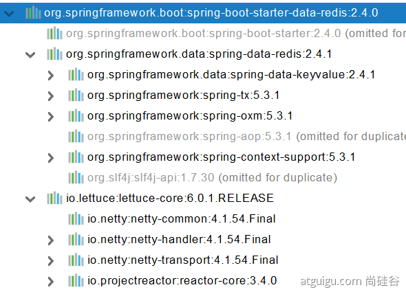

自动配置：

- RedisAutoConfiguration自动配置类。RedisProperties属性类 --> spring.redis.xxx是对Redis的配置
- 连接工厂是准备好的。LettuceConnectionConfiguration、**Jedis**ConnectionConfiguration
- **自动注入了RedisTemplate**<**Object**, **Object**> ： xxxTemplate；
- **自动注入了StringRedisTemplate；k：v都是String**
- **key：value**
- **底层只要我们使用 StringRedisTemplate、RedisTemplate就可以操作redis**


**redis环境搭建**

**1、阿里云按量付费redis。经典网络**

**2、申请redis的公网连接地址**

**3、修改白名单  允许0.0.0.0/0 访问**


#### 2.2、RedisTemplate与Lettuce

```java
    @Test
    void testRedis(){
        ValueOperations<String, String> operations = redisTemplate.opsForValue();

        operations.set("hello","world");

        String hello = operations.get("hello");
        System.out.println(hello);
    }
```


#### 2.3、切换至jedis

```xml
<dependency>
    <groupId>org.springframework.boot</groupId>
    <artifactId>spring-boot-starter-data-redis</artifactId>
</dependency>

<!--        导入jedis-->
<dependency>
    <groupId>redis.clients</groupId>
    <artifactId>jedis</artifactId>
</dependency>
```

```yaml
spring:
  redis:
      host: r-bp1nc7reqesxisgxpipd.redis.rds.aliyuncs.com
      port: 6379
      password: lfy:Lfy123456
      client-type: jedis
      jedis:
        pool:
          max-active: 10
```


## 七、单元测试

### 1、JUnit5的变化

**Spring Boot 2.2.0 版本开始引入 JUnit 5 作为单元测试默认库**

作为最新版本的JUnit框架，Junit5与之前版本的Junit框架有很大的不同。由三个子项目的几个不同模块组成

> **JUnit 5 = JUnit Platform + JUnit Jupiter + JUnit Vintage**

**JUnit Platform**: Junit Platform是在JVM上启动测试框架的基础，不仅支持Junit自制的测试引擎，其他测试引擎也都可以接入。

**JUnit Jupiter**: JUnit Jupiter提供了JUnit5的新的编程模型，是JUnit5新特性的核心。内部 包含了一个**测试引擎**，用于在Junit Platform上运行。

**JUnit Vintage**: 由于JUint已经发展多年，为了照顾老的项目，JUnit Vintage提供了兼容JUnit4.x,Junit3.x的测试引擎。


注意：

**SpringBoot 2.4 以上版本移除了默认对** **Vintage 的依赖。如果需要兼容junit4需要自行引入（不能使用junit4的功能 @Test****）**

**JUnit 5’s Vintage Engine Removed from** `spring-boot-starter-test,如果需要继续兼容junit4需要自行引入vintage`

```xml
<dependency>
    <groupId>org.junit.vintage</groupId>
    <artifactId>junit-vintage-engine</artifactId>
    <scope>test</scope>
    <exclusions>
        <exclusion>
            <groupId>org.hamcrest</groupId>
            <artifactId>hamcrest-core</artifactId>
        </exclusion>
    </exclusions>
</dependency>
```


```xml
<dependency>
  <groupId>org.springframework.boot</groupId>
  <artifactId>spring-boot-starter-test</artifactId>
  <scope>test</scope>
</dependency>
```

现在版本：

```java
@SpringBootTest
class Boot05WebAdminApplicationTests {


    @Test
    void contextLoads() {

    }
}


```


以前版本：

@SpringBootTest + @RunWith(SpringTest.class)


SpringBoot整合Junit以后。

- 编写测试方法：@Test标注（注意需要使用junit5版本的注解）
- Junit类具有Spring的功能，@Autowired、比如 @Transactional 标注测试方法，**测试完成后自动回滚**


### 2、Junit5常用注解

Junit5的注解与Junit4的注解有所变化

- **@Test**：表示方法是测试方法。但是与Junit4的@Test不同，他的职责非常单一不能声明任何属性，扩展的测试将会有Jupiter提供额外测试
- **@ParameterizedTest**：表示方法是参数化测试，下方会有详细介绍
- **@RepeatedTest**：表示方法可重复执行，下方会有详细介绍
- **@DisplayName**：为测试类或者测试方法设置展示名称
- **@BeforeEach**：表示在**每个**单元测试之前执行 【也就是一个方法执行一遍都执行】
- **@AfterEach**：表示在**每个**单元测试之后执行
- **@BeforeAll**：表示在**所有**单元测试之前执行【也就是一个类执行一遍就执行】
- **@AfterAll**：表示在**所有**单元测试之后执行
- **@Tag**：表示单元测试类别，类似于Junit4的@Categories
- **@Disabled**：表示测试类或测试方法不执行，类似于Junit4的@lgnore
- **@Timeout**：表示测试方法运行如果超过了指定时间将会返回错误
- **@ExtendWith**：为测试类或测试方法提供扩展类引用
- **@SpringBootTest**：标记测试类

```java
import org.junit.jupiter.api.Test; //注意这里使用的是jupiter的Test注解！！


public class TestDemo {

  @Test
  @DisplayName("第一次测试")
  public void firstTest() {
      System.out.println("hello world");
  }
```


### 3、断言（assertions）

断言（assertions）是测试方法中的核心部分，用来对测试满足的条件进行验证。这些断言方法都是 **org.junit.jupiter.api.Assertions** 的静态方法。

**断言——断定某件事情一定会发生，如果不发生就判定出问题**

Junit内置的断言可以分成如下几个类别

**检查业务逻辑返回的数据是否合理**

**所有测试运行结束以后，会有一个详细的测试报告**

断言失败，在此断言之后的代码均==不执行==

#### 3.1、简单断言

用来对单个值进行简单的验证，如：

| 方法            | 说明                                 |
| --------------- | ------------------------------------ |
| assertEquals    | 判断两个对象或两个原始类型是否相等   |
| assertNotEquals | 判断两个对象或两个原始类型是否不相等 |
| assertSame      | 判断两个对象引用是否指向同一个对象   |
| assertNotSame   | 判断两个对象引用是否指向不同的对象   |
| assertTrue      | 判断给定的布尔值是否为 true          |
| assertFalse     | 判断给定的布尔值是否为 false         |
| assertNull      | 判断给定的对象引用是否为 null        |
| assertNotNull   | 判断给定的对象引用是否不为 null      |

```java
@Test
@DisplayName("simple assertion")
public void simple() {
     assertEquals(3, 1 + 2, "simple math");
     assertNotEquals(3, 1 + 1);

     assertNotSame(new Object(), new Object());
     Object obj = new Object();
     assertSame(obj, obj);

     assertFalse(1 > 2);
     assertTrue(1 < 2);

     assertNull(null);
     assertNotNull(new Object());
}
```


#### 3.2、数组断言

通过assertArrayEquals方法来判断两个对象或原始类型的数组是否相等

```java
@Test
@DisplayName("array assertion")
public void array() {
    assertArrayEquals(new int[]{1, 2}, new int[] {1, 2});
}
```


#### 3.3、组合断言

assertAll方法接受多个 org.junit.jupiter.api.Executable 函数式接口的实例作为要验证的断言，可以通过 lambda 表达式很容易的提供这些断言

```java
@Test
@DisplayName("assert all")
public void all() {
    assertAll("Math",() -> assertEquals(2, 1 + 1),() -> assertTrue(1 > 0));
}
```


#### 3.4、异常断言

在JUnit4时期，想要测试方法的异常情况时，需要用**@Rule**注解的ExpectedException变量还是比较麻烦的。而JUnit5提供了一种新的断言方式**Assertions.assertThrows()** ,配合函数式编程就可以进行使用。

```java
@Test
@DisplayName("异常测试")
public void exceptionTest() {
    ArithmeticException exception = Assertions.assertThrows(
           //扔出断言异常
            ArithmeticException.class, () -> System.out.println(1 % 0));

}
```


#### 3.5、超时断言

Junit5还提供了**Assertions.assertTimeout()** 为测试方法设置了超时时间

```java
@Test
@DisplayName("超时测试")
public void timeoutTest() {
    //如果测试方法时间超过1s将会异常
    Assertions.assertTimeout(Duration.ofMillis(1000), () -> Thread.sleep(500));
}
```


#### 3.6、快速失败

通过fail方法直接使得测试失败

```java
@Test
@DisplayName("fail")
public void shouldFail() {
    fail("This should fail");
}
```


### 4、前置条件

JUnit 5 中的前置条件（**assumptions【假设】**）类似于断言，不同之处在于**不满足的断言会使得测试方法失败**，而不满足的**前置条件只会使得测试方法的执行终止**。前置条件可以看成是测试方法执行的前提，当该前提不满足时，就没有继续执行的必要。

```java
@DisplayName("前置条件")
public class AssumptionsTest {
 private final String environment = "DEV";
 
 @Test
 @DisplayName("simple")
 public void simpleAssume() {
    assumeTrue(Objects.equals(this.environment, "DEV"));
    assumeFalse(() -> Objects.equals(this.environment, "PROD"));
 }
 
 @Test
 @DisplayName("assume then do")
 public void assumeThenDo() {
    assumingThat(
       Objects.equals(this.environment, "DEV"),
       () -> System.out.println("In DEV")
    );
 }
}
```

assumeTrue 和 assumFalse 确保给定的条件为 true 或 false，不满足条件会使得测试执行终止。assumingThat 的参数是表示条件的布尔值和对应的 Executable 接口的实现对象。只有条件满足时，Executable 对象才会被执行；当条件不满足时，测试执行并不会终止。


### 5、嵌套测试

JUnit 5 可以通过 Java 中的内部类和@Nested 注解实现嵌套测试，从而可以更好的把相关的测试方法组织在一起。在内部类中可以使用@BeforeEach 和@AfterEach 注解，而且嵌套的层次没有限制。

```java
@DisplayName("A stack")
class TestingAStackDemo {

    Stack<Object> stack;

    @Test
    @DisplayName("is instantiated with new Stack()")
    void isInstantiatedWithNew() {
        new Stack<>();
    }

    @Nested
    @DisplayName("when new")
    class WhenNew {

        @BeforeEach
        void createNewStack() {
            stack = new Stack<>();
        }

        @Test
        @DisplayName("is empty")
        void isEmpty() {
            assertTrue(stack.isEmpty());
        }

        @Test
        @DisplayName("throws EmptyStackException when popped")
        void throwsExceptionWhenPopped() {
            assertThrows(EmptyStackException.class, stack::pop);
        }

        @Test
        @DisplayName("throws EmptyStackException when peeked")
        void throwsExceptionWhenPeeked() {
            assertThrows(EmptyStackException.class, stack::peek);
        }

        @Nested
        @DisplayName("after pushing an element")
        class AfterPushing {

            String anElement = "an element";

            @BeforeEach
            void pushAnElement() {
                stack.push(anElement);
            }

            @Test
            @DisplayName("it is no longer empty")
            void isNotEmpty() {
                assertFalse(stack.isEmpty());
            }

            @Test
            @DisplayName("returns the element when popped and is empty")
            void returnElementWhenPopped() {
                assertEquals(anElement, stack.pop());
                assertTrue(stack.isEmpty());
            }

            @Test
            @DisplayName("returns the element when peeked but remains not empty")
            void returnElementWhenPeeked() {
                assertEquals(anElement, stack.peek());
                assertFalse(stack.isEmpty());
            }
        }
    }
}
```


### 6、参数化测试

参数化测试是JUnit5很重要的一个新特性，它使得用不同的参数多次运行测试成为了可能，也为我们的单元测试带来许多便利。

利用**@ValueSource**等注解，指定入参，我们将可以使用不同的参数进行多次单元测试，而不需要每新增一个参数就新增一个单元测试，省去了很多冗余代码。


**@ValueSource**: 为参数化测试指定入参来源，支持八大基础类以及String类型,Class类型

**@NullSource**: 表示为参数化测试提供一个null的入参

**@EnumSource**: 表示为参数化测试提供一个枚举入参

**@CsvFileSource**：表示读取指定CSV文件内容作为参数化测试入参

**@MethodSource**：表示读取指定方法的返回值作为参数化测试入参(注意方法返回需要是一个流)


> 当然如果参数化测试仅仅只能做到指定普通的入参还达不到让我觉得惊艳的地步。让我真正感到他的强大之处的地方在于他可以支持外部的各类入参。如:CSV,YML,JSON 文件甚至方法的返回值也可以作为入参。只需要去实现**ArgumentsProvider**接口，任何外部文件都可以作为它的入参。

```java 
@ParameterizedTest
@ValueSource(strings = {"one", "two", "three"})
@DisplayName("参数化测试1")
public void parameterizedTest1(String string) {
    System.out.println(string);
    Assertions.assertTrue(StringUtils.isNotBlank(string));
}


@ParameterizedTest
@MethodSource("method")    //指定方法名
@DisplayName("方法来源参数")
public void testWithExplicitLocalMethodSource(String name) {
    System.out.println(name);
    Assertions.assertNotNull(name);
}

static Stream<String> method() {
    return Stream.of("apple", "banana");
}
```


### 7、前移指南

在进行迁移的时候需要注意如下的变化：

- 注解在 org.junit.jupiter.api 包中，断言在 org.junit.jupiter.api.Assertions 类中，前置条件在 org.junit.jupiter.api.Assumptions 类中。
- 把@Before 和@After 替换成@BeforeEach 和@AfterEach。
- 把@BeforeClass 和@AfterClass 替换成@BeforeAll 和@AfterAll。
- 把@Ignore 替换成@Disabled。
- 把@Category 替换成@Tag。
- 把@RunWith、@Rule 和@ClassRule 替换成@ExtendWith。


## 八、指标监控

### 1、SpringBoot Actuator

#### 1.1、简介

未来每一个微服务在云上部署以后，我们都需要对其进行监控、追踪、审计、控制等。SpringBoot就抽取了Actuator场景，使得我们每个微服务快速应用即可获得生产级别的应用监控、审计等功能

```xml
<dependency>
    <groupId>org.springframework.boot</groupId>
    <artifactId>spring-boot-starter-actuator</artifactId>
</dependency>
```


#### 1.2、1.x和2.x的区别

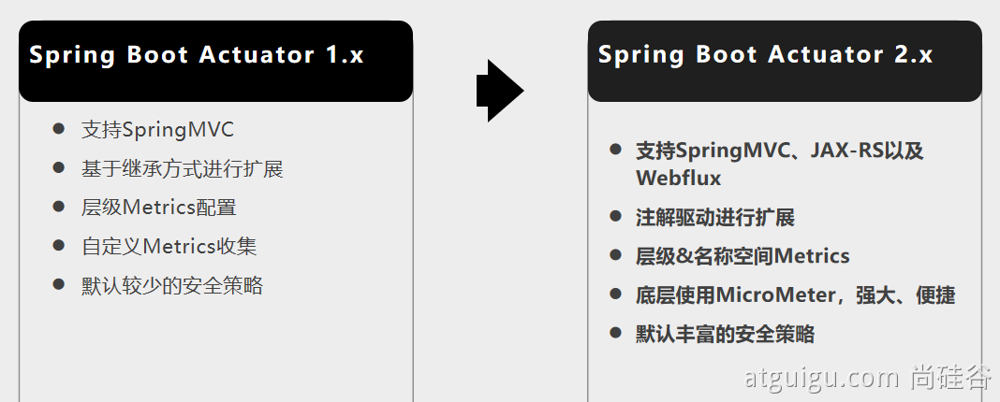


#### 1.3、如何用

- 引入场景

- 访问 http://localhost:8080/actuator/\**

- 暴露所有监控信息为HTTP

  ```yaml
  management:
    endpoints:
      enabled-by-default: true #暴露所有端点信息
      web:
        exposure:
          include: '*'  #以web方式暴露
  ```

- 测试

  http://localhost:8080/actuator/beans

  http://localhost:8080/actuator/configprops

  http://localhost:8080/actuator/metrics

  http://localhost:8080/actuator/metrics/jvm.gc.pause

  [http://localhost:8080/actuator/](http://localhost:8080/actuator/metrics)endpointName/detailPath

  。。。。。。


#### 1.4、可视化

https://github.com/codecentric/spring-boot-admin

- 引入依赖

  ```xml
  <dependency>
      <groupId>de.codecentric</groupId>
      <artifactId>spring-boot-admin-starter-server</artifactId>
      <version>2.5.1</version>
  </dependency>
  <dependency>
      <groupId>org.springframework.boot</groupId>
      <artifactId>spring-boot-starter-web</artifactId>
  </dependency>
  ```

- 开启服务器监控功能——在启动类标注 **@EnableAdminServer**并修改端口号为其他

  ```java 
  @EnableAdminServer 
  @SpringBootApplication
  public class Boot05AdminserverApplication {
  
      public static void main(String[] args) {
          SpringApplication.run(Boot05AdminserverApplication.class, args);
      }
  
  }
  ```

- 启动即可监控服务

- 如何将别的应用被监控到？

  - 引入依赖

    ```xml
    <dependency>
        <groupId>de.codecentric</groupId>
        <artifactId>spring-boot-admin-starter-client</artifactId>
        <version>2.5.1</version>
    </dependency>
    ```

  - 修改配置，写明将服务交给谁监控

    ```properties
    # 端口号与监控器服务器设置的相同
    spring.boot.admin.client.url=http://localhost:8888
    management.endpoints.enabled-by-default=true
    management.endpoints.web.exposure.include='*'
    ```

  - 运行服务器即可以被监控到


### 2、Actuator Endpoint

#### 2.1、最常用的端点

| ID                 | 描述                                                         |
| ------------------ | ------------------------------------------------------------ |
| `auditevents`      | 暴露当前应用程序的审核事件信息。需要一个`AuditEventRepository组件`。 |
| `beans`            | 显示应用程序中所有Spring Bean的完整列表。                    |
| `caches`           | 暴露可用的缓存。                                             |
| `conditions`       | 显示自动配置的所有条件信息，包括匹配或不匹配的原因。         |
| `configprops`      | 显示所有`@ConfigurationProperties`。                         |
| `env`              | 暴露Spring的属性`ConfigurableEnvironment`                    |
| `flyway`           | 显示已应用的所有Flyway数据库迁移。 需要一个或多个`Flyway`组件。 |
| `health`           | 显示应用程序运行状况信息。                                   |
| `httptrace`        | 显示HTTP跟踪信息（默认情况下，最近100个HTTP请求-响应）。需要一个`HttpTraceRepository`组件。 |
| `info`             | 显示应用程序信息。                                           |
| `integrationgraph` | 显示Spring `integrationgraph` 。需要依赖`spring-integration-core`。 |
| `loggers`          | 显示和修改应用程序中日志的配置。                             |
| `liquibase`        | 显示已应用的所有Liquibase数据库迁移。需要一个或多个`Liquibase`组件。 |
| `metrics`          | 显示当前应用程序的“指标”信息。                               |
| `mappings`         | 显示所有`@RequestMapping`路径列表。                          |
| `scheduledtasks`   | 显示应用程序中的计划任务。                                   |
| `sessions`         | 允许从Spring Session支持的会话存储中检索和删除用户会话。需要使用Spring Session的基于Servlet的Web应用程序。 |
| `shutdown`         | 使应用程序正常关闭。默认禁用。                               |
| `startup`          | 显示由`ApplicationStartup`收集的启动步骤数据。需要使用`SpringApplication`进行配置`BufferingApplicationStartup`。 |
| `threaddump`       | 执行线程转储。                                               |


如果您的应用程序时Web应用程序（SpringMVC、SpringWebFlux 或 Jersey）则可以使用一下附加断点

| ID           | 描述                                                         |
| ------------ | ------------------------------------------------------------ |
| `heapdump`   | 返回`hprof`堆转储文件。                                      |
| `jolokia`    | 通过HTTP暴露JMX bean（需要引入Jolokia，不适用于WebFlux）。需要引入依赖`jolokia-core`。 |
| `logfile`    | 返回日志文件的内容（如果已设置`logging.file.name`或`logging.file.path`属性）。支持使用HTTP`Range`标头来检索部分日志文件的内容。 |
| `prometheus` | 以Prometheus服务器可以抓取的格式公开指标。需要依赖`micrometer-registry-prometheus`。 |


最常用的Endpoint

- **Health：监控状况**
- **Metrics：运行时指标**
- **Loggers：日志记录**


#### 2.2、Health Endpoint

健康检查端点，我们一般用于在云平台，平台会定时的检查应用的健康状况，我们就需要Health Endpoint可以为平台返回当前应用的一系列组件健康状况的集合。

重要的几点：

- health endpoint返回的结果，应该是一系列健康检查后的一个**汇总报告**
- 很多的健康检查默认已经自动配置好了，比如：数据库、redis等
- 可以很容易的添加自定义的健康检查机制


#### 2.3、Metrics Endpoint

提供详细的、层级的、空间指标信息，这些信息可以被pull（主动推送）或者push（被动获取）方式得到；

- 通过Metrics对接多种监控系统
- 简化核心Metrics开发
- 添加自定义Metrics或者扩展已有Metric


#### 2.4、管理Endpoints

##### 1、开启与禁用Endpoint

- 默认所有的Endpoint除过shutdown都是开启的
- 需要开启或禁用某个Endpoint。配置默认为  **management.endpoint.** **\<endpointName>** **.enabled = true**

```yaml
management:
  endpoint:
    beans:
      enabled: true
```

- 或者禁用所有的Endpoint然后手动开启指定的Endpoint

```yaml
management:
  endpoints:
    enabled-by-default: false
  endpoint:
    beans:
      enabled: true
    health:
      enabled: true
```


##### 2、暴露Endpoints

支持的暴露方式

- HTTP：默认只暴露**health**和**info** Endpoint
- **JMX**：默认暴露所有Endpoint
- 除过health和info，剩下的Endpoint都应该进行保护访问。如果引入SpringSecurity，则会默认配置安全访问规则

| ID                 | JMX  | Web  |
| ------------------ | ---- | ---- |
| `auditevents`      | Yes  | No   |
| `beans`            | Yes  | No   |
| `caches`           | Yes  | No   |
| `conditions`       | Yes  | No   |
| `configprops`      | Yes  | No   |
| `env`              | Yes  | No   |
| `flyway`           | Yes  | No   |
| `health`           | Yes  | Yes  |
| `heapdump`         | N/A  | No   |
| `httptrace`        | Yes  | No   |
| `info`             | Yes  | Yes  |
| `integrationgraph` | Yes  | No   |
| `jolokia`          | N/A  | No   |
| `logfile`          | N/A  | No   |
| `loggers`          | Yes  | No   |
| `liquibase`        | Yes  | No   |
| `metrics`          | Yes  | No   |
| `mappings`         | Yes  | No   |
| `prometheus`       | N/A  | No   |
| `scheduledtasks`   | Yes  | No   |
| `sessions`         | Yes  | No   |
| `shutdown`         | Yes  | No   |
| `startup`          | Yes  | No   |
| `threaddump`       | Yes  | No   |


### 3、定制Endpoint

#### 3.1、定制Health信息

```java
import org.springframework.boot.actuate.health.Health;
import org.springframework.boot.actuate.health.HealthIndicator;
import org.springframework.stereotype.Component;

@Component
public class MyHealthIndicator implements HealthIndicator {

    @Override
    public Health health() {
        int errorCode = check(); // perform some specific health check
        if (errorCode != 0) {
            return Health.down().withDetail("Error Code", errorCode).build();
        }
        return Health.up().build();
    }

}

构建Health
Health build = Health.down()
                .withDetail("msg", "error service")
                .withDetail("code", "500")
                .withException(new RuntimeException())
                .build();
```

```yaml
management:
    health:
      enabled: true
      show-details: always #总是显示详细信息。可显示每个模块的状态信息
```

```java
@Component
public class MyComHealthIndicator extends AbstractHealthIndicator {

    /**
     * 真实的检查方法
     * @param builder
     * @throws Exception
     */
    @Override
    protected void doHealthCheck(Health.Builder builder) throws Exception {
        //mongodb。  获取连接进行测试
        Map<String,Object> map = new HashMap<>();
        // 检查完成
        if(1 == 2){
//            builder.up(); //健康
            builder.status(Status.UP);
            map.put("count",1);
            map.put("ms",100);
        }else {
//            builder.down();
            builder.status(Status.OUT_OF_SERVICE);
            map.put("err","连接超时");
            map.put("ms",3000);
        }


        builder.withDetail("code",100)
                .withDetails(map);

    }
}
```


#### 3.2、定制info信息

常用两种方式

##### 1、编写配置文件

```yaml
info:
  appName: boot-admin
  version: 2.0.1
  mavenProjectName: @project.artifactId@  #使用@@可以获取maven的pom文件值
  mavenProjectVersion: @project.version@
```


##### 2、编写InfoContributor

```java
import java.util.Collections;

import org.springframework.boot.actuate.info.Info;
import org.springframework.boot.actuate.info.InfoContributor;
import org.springframework.stereotype.Component;

@Component
public class ExampleInfoContributor implements InfoContributor {

    @Override
    public void contribute(Info.Builder builder) {
        builder.withDetail("example",
                Collections.singletonMap("key", "value"));
    }

}
```

http://localhost:8080/actuator/info 会输出以上方式返回的所有info信息


#### 3.3、定制Metrics信息

##### 1、SpringBoot支持自动适配的Metrics

- JVM metrics, report utilization of:

- - Various memory and buffer pools
  - Statistics related to garbage collection
  - Threads utilization
  - Number of classes loaded/unloaded

- CPU metrics
- File descriptor metrics
- Kafka consumer and producer metrics
- Log4j2 metrics: record the number of events logged to Log4j2 at each level
- Logback metrics: record the number of events logged to Logback at each level
- Uptime metrics: report a gauge for uptime and a fixed gauge representing the application’s absolute start time
- Tomcat metrics (`server.tomcat.mbeanregistry.enabled` must be set to `true` for all Tomcat metrics to be registered)
- [Spring Integration](https://docs.spring.io/spring-integration/docs/5.4.1/reference/html/system-management.html#micrometer-integration) metrics

##### 2、增加定制Metrics

```java
class MyService{
    Counter counter;
    public MyService(MeterRegistry meterRegistry){
         counter = meterRegistry.counter("myservice.method.running.counter");
    }

    public void hello() {
        counter.increment();
    }
}


//也可以使用下面的方式
@Bean
MeterBinder queueSize(Queue queue) {
    return (registry) -> Gauge.builder("queueSize", queue::size).register(registry);
}
```


#### 3.4、定制Endpoint

```java
@Component
@Endpoint(id = "container")
public class DockerEndpoint {


    @ReadOperation
    public Map getDockerInfo(){
        return Collections.singletonMap("info","docker started...");
    }

    @WriteOperation
    private void restartDocker(){
        System.out.println("docker restarted....");
    }

}
```

场景：开发**ReadinessEndpoint**来管理程序是否就绪，或者**Liveness****Endpoint**来管理程序是否存活；

当然，这个也可以直接使用 https://docs.spring.io/spring-boot/docs/current/reference/html/production-ready-features.html#production-ready-kubernetes-probes


## 九、原理解析

### 1、Profile功能

为了方便多环境适配，SpringBoot简化了profile功能

#### 1.1、application-profile功能

- 默认配置文件application.yaml 任何时候都会加载

- 指定环境配置文件 application-{env}.yaml

- 激活指定环境
  - 配置文件激活
  - 命令行激活：java -jar xxx.jar --spring.profiles.active=prod --verson.name=haha
    - **修改配置文件的任意值，命令行优先**
  - 默认配置与环境配置同时生效
  - 同名配置项，profile配置优先
  
  

#### 1.2、@Profile条件装配功能

```java
@Configuration(proxyBeanMethods = false)
@Profile("production")
public class ProductionConfiguration {

    // ...

}
```


#### 1.3、profile分组

```tex
spring.profiles.group.production[0]=proddb
spring.profiles.group.production[1]=prodmq

使用：--spring.profiles.active=production  激活
```


### 2、外部化配置

https://docs.spring.io/spring-boot/docs/current/reference/html/spring-boot-features.html#boot-features-external-config

## 

1. Default properties (specified by setting `SpringApplication.setDefaultProperties`).
2. `@PropertySource` annotations on your `@Configuration` classes. Please note that such property sources are not added to the `Environment` until the application context is being refreshed. This is too late to configure certain properties such as `logging.*` and `spring.main.*` which are read before refresh begins.
3. **Config data (such as** `**application.properties**` **files)**
4. A `RandomValuePropertySource` that has properties only in `random.*`.
5. OS environment variables.
6. Java System properties (`System.getProperties()`).
7. JNDI attributes from `java:comp/env`.
8. `ServletContext` init parameters.
9. `ServletConfig` init parameters.
10. Properties from `SPRING_APPLICATION_JSON` (inline JSON embedded in an environment variable or system property).
11. Command line arguments.
12. `properties` attribute on your tests. Available on `@SpringBootTest` and the [test annotations for testing a particular slice of your application](https://docs.spring.io/spring-boot/docs/current/reference/html/spring-boot-features.html#boot-features-testing-spring-boot-applications-testing-autoconfigured-tests).
13. `@TestPropertySource` annotations on your tests.
14. [Devtools global settings properties](https://docs.spring.io/spring-boot/docs/current/reference/html/using-spring-boot.html#using-boot-devtools-globalsettings) in the `$HOME/.config/spring-boot` directory when devtools is active.


#### 2.1、外部配置源

常用：Java属性文件、YAML文件、环境变量、命令行参数


#### 2.2、配置文件查找位置

(1) classpath 根路径

(2) classpath 根路径下config目录

(3) jar包当前目录

(4) jar包当前目录的config目录

(5) /config子目录的直接子目录


#### 2.3、配置文件加载顺序

1. 　当前jar包内部的application.properties和application.yml
2. 　当前jar包内部的application-{profile}.properties 和 application-{profile}.yml
3. 　引用的外部jar包的application.properties和application.yml
4. 　引用的外部jar包的application-{profile}.properties 和 application-{profile}.yml


#### 2.4、指定环境优先，外部优先，后面的可以覆盖前面的同名配置项


### 3、自定义starter

#### 3.1、starter启动原理

- starter-pom引入autoconfigurer包

- autoconfigure包中配置使用 **META-INF/spring.factories** 中 **EnableAutoConfiguration 的值，使得项目启动加载指定的自动配置类**
- **编写自动配置类 xxxAutoConfiguration -> xxxxProperties**

- - **@Configuration**
  - **@Conditional**
  - **@EnableConfigurationProperties**
  - **@Bean**
  - ......

**引入starter** **--- xxxAutoConfiguration --- 容器中放入组件 ---- 绑定xxxProperties ----** **配置项**


#### 3.2、自定义starter

**atguigu-hello-spring-boot-starter（启动器）**

**atguigu-hello-spring-boot-starter-autoconfigure（自动配置包）**


### 4、SpringBoot原理

Spring原理【[Spring注解](https://www.bilibili.com/video/BV1gW411W7wy?p=1)】、**SpringMVC**原理、**自动配置原理**、SpringBoot原理

#### 4.1、SpringBoot启动过程

- 创建SpringApplication

  - 保存一些信息
  - 判定当前应用的类型。ClassUtils。Servlet
  - bootstrappers：初始化启动引导器（List\<Bootstrapper>）:去spring.factories文件中找 org.springframework.boot.BootStrapper
  - 找**ApplicationContextInitializer**；去**spring.factories****找** **ApplicationContextInitializer**
    - List\<ApplicationContextInitializer<?>> initializer 
  - 找ApplicationListener；应用监听器。去spring.factories找ApplicationListener
    - List\<ApplicationListener<?>> listeners

- 运行 **SpringApplication**

  - **StopWatch**
  - **记录应用的启动时间**
  - **创建引导上下文（Context环境）****createBootstrapContext()**

    - 获取到所有之前的 **bootstrappers 挨个执行** intitialize() 来完成对引导启动器上下文环境设置

  - 让当前应用进入**headless**模式。**java.awt.headless**

  - **获取所有** **RunListener****（运行监听器）【为了方便所有Listener进行事件感知】**

    - getSpringFactoriesInstances 去**spring.factories****找** **SpringApplicationRunListener**. 

  - 遍历 **SpringApplicationRunListener 调用 starting 方法；**

    - **相当于通知所有感兴趣系统正在启动过程的人，项目正在 starting。**

  - 保存命令行参数；ApplicationArguments

  - 准备环境 prepareEnvironment（）;

    - 返回或者创建基础环境信息对象。**StandardServletEnvironment**
      - **配置环境信息对象。**
      - **读取所有的配置源的配置属性值。**

    - 绑定环境信息

  - 监听器调用 listener.environmentPrepared()；通知所有的监听器当前环境准备完成

  - 创建IOC容器（createApplicationContext（））

    - 根据项目类型（Servlet）创建容器，

  - 当前会创建 **AnnotationConfigServletWebServerApplicationContext**

    - **准备ApplicationContext IOC容器的基本信息**  **prepareContext()**

      - 保存环	境信息

        - IOC容器的后置处理流程。
        - 应用初始化器；applyInitializers；
          - 遍历所有的 **ApplicationContextInitializer 。调用** **initialize.。来对ioc容器进行初始化扩展功能**
            - 遍历所有的 listener 调用 **contextPrepared。EventPublishRunListenr；通知所有的监听器****contextPrepared**

        - **所有的监听器 调用** **contextLoaded。通知所有的监听器** **contextLoaded；**

      - **刷新IOC容器。**refreshContext

        - 创建容器中的所有组件（Spring注解）

      - 容器刷新完成后工作？afterRefresh

        - 所有监听 器 调用 listeners.**started**(context); **通知所有的监听器** **started**
        - **调用所有runners；**callRunners()

        - **获取容器中的** **ApplicationRunner** 
          - **获取容器中的**  **CommandLineRunner**
          - **合并所有runner并且按照@Order进行排序**
          - **遍历所有的runner。调用 run** **方法**

      - **如果以上有异常，**

        - **调用Listener 的 failed**
        - **调用所有监听器的 running 方法**  listeners.running(context); **通知所有的监听器** **running** 

      - **running如果有问题。继续通知 failed 。****调用所有 Listener 的** **failed；****通知所有的监听器** **failed**


```java 
public interface Bootstrapper {

	/**
	 * Initialize the given {@link BootstrapRegistry} with any required registrations.
	 * @param registry the registry to initialize
	 */
	void intitialize(BootstrapRegistry registry);

}
```


```java 
@FunctionalInterface
public interface ApplicationRunner {

	/**
	 * Callback used to run the bean.
	 * @param args incoming application arguments
	 * @throws Exception on error
	 */
	void run(ApplicationArguments args) throws Exception;

}
```

```java
@FunctionalInterface
public interface CommandLineRunner {

	/**
	 * Callback used to run the bean.
	 * @param args incoming main method arguments
	 * @throws Exception on error
	 */
	void run(String... args) throws Exception;

}
```


#### 4.2、Application Events and Listeners

https://docs.spring.io/spring-boot/docs/current/reference/html/spring-boot-features.html#boot-features-application-events-and-listeners

**ApplicationContextInitializer**

**ApplicationListener**

**SpringApplicationRunListener**


#### 4.3、ApplicationRunner 与 CommondLineRunner


# 附录

文档地址： https://www.yuque.com/atguigu/springboot

视频地址：https://www.bilibili.com/video/BV19K4y1L7MT?p=1

源码地址：https://gitee.com/leifengyang/springboot2

​	
